# Baserow Architecture Documentation

This document provides a comprehensive overview of Baserow's architecture, including system components, data flows, and key architectural patterns.

## Table of Contents

1. [High-Level System Architecture](#high-level-system-architecture)
2. [Backend Architecture](#backend-architecture)
3. [Frontend Architecture](#frontend-architecture)
4. [Request Flow](#request-flow)
5. [WebSocket Real-Time Communication](#websocket-real-time-communication)
6. [Database Field Type System](#database-field-type-system)
7. [Action System (Undo/Redo)](#action-system-undoredo)
8. [Plugin Architecture](#plugin-architecture)
9. [Authentication & Authorization](#authentication--authorization)
10. [Job Queue System](#job-queue-system)

---

## High-Level System Architecture

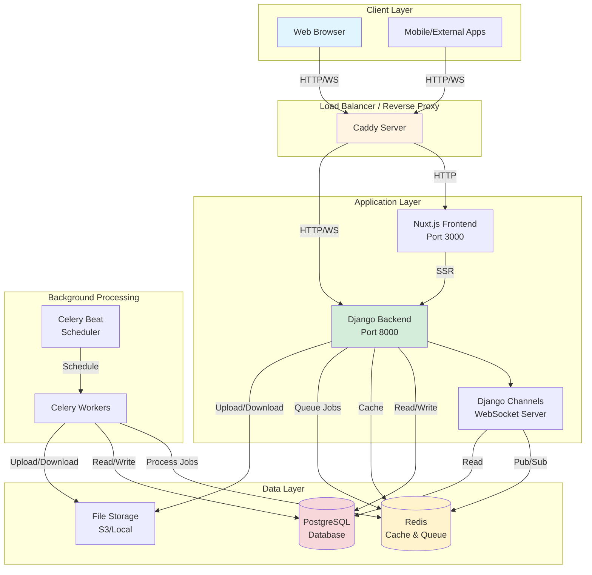
```mermaid
graph TB
    subgraph "Client Layer"
        Browser[Web Browser]
        Mobile[Mobile/External Apps]
    end

    subgraph "Load Balancer / Reverse Proxy"
        Caddy[Caddy Server]
    end

    subgraph "Application Layer"
        Nuxt[Nuxt.js Frontend<br/>Port 3000]
        Django[Django Backend<br/>Port 8000]
        Channels[Django Channels<br/>WebSocket Server]
    end

    subgraph "Background Processing"
        Celery[Celery Workers]
        CeleryBeat[Celery Beat<br/>Scheduler]
    end

    subgraph "Data Layer"
        Postgres[(PostgreSQL<br/>Database)]
        Redis[(Redis<br/>Cache & Queue)]
        FileStorage[File Storage<br/>S3/Local]
    end

    Browser -->|HTTP/WS| Caddy
    Mobile -->|HTTP/WS| Caddy
    Caddy -->|HTTP| Nuxt
    Caddy -->|HTTP/WS| Django
    Django --> Channels
    Django -->|Read/Write| Postgres
    Django -->|Cache| Redis
    Django -->|Queue Jobs| Redis
    Celery -->|Process Jobs| Redis
    Celery -->|Read/Write| Postgres
    Celery -->|Upload/Download| FileStorage
    CeleryBeat -->|Schedule| Celery
    Django -->|Upload/Download| FileStorage
    Channels -->|Pub/Sub| Redis
    Channels -->|Read| Postgres
    Nuxt -->|SSR| Django

    style Browser fill:#e1f5ff
    style Caddy fill:#fff4e1
    style Django fill:#d4edda
    style Postgres fill:#f8d7da
    style Redis fill:#fff3cd
```

---

## Backend Architecture

### Layer Architecture

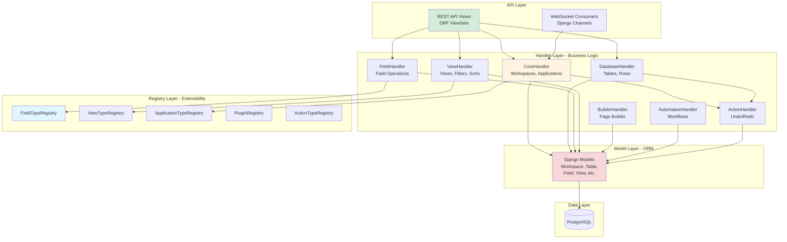
```mermaid
graph TB
    subgraph "API Layer"
        REST[REST API Views<br/>DRF ViewSets]
        WS[WebSocket Consumers<br/>Django Channels]
    end

    subgraph "Handler Layer - Business Logic"
        CoreHandler[CoreHandler<br/>Workspaces, Applications]
        DatabaseHandler[DatabaseHandler<br/>Tables, Rows]
        FieldHandler[FieldHandler<br/>Field Operations]
        ViewHandler[ViewHandler<br/>Views, Filters, Sorts]
        BuilderHandler[BuilderHandler<br/>Page Builder]
        AutomationHandler[AutomationHandler<br/>Workflows]
        ActionHandler[ActionHandler<br/>Undo/Redo]
    end

    subgraph "Registry Layer - Extensibility"
        FieldRegistry[FieldTypeRegistry]
        ViewRegistry[ViewTypeRegistry]
        AppRegistry[ApplicationTypeRegistry]
        PluginRegistry[PluginRegistry]
        ActionRegistry[ActionTypeRegistry]
    end

    subgraph "Model Layer - ORM"
        Models[Django Models<br/>Workspace, Table,<br/>Field, View, etc.]
    end

    subgraph "Data Layer"
        DB[(PostgreSQL)]
    end

    REST --> CoreHandler
    REST --> DatabaseHandler
    REST --> FieldHandler
    REST --> ViewHandler
    WS --> CoreHandler

    CoreHandler --> ActionHandler
    DatabaseHandler --> ActionHandler
    FieldHandler --> FieldRegistry
    ViewHandler --> ViewRegistry
    CoreHandler --> AppRegistry

    CoreHandler --> Models
    DatabaseHandler --> Models
    FieldHandler --> Models
    ViewHandler --> Models
    BuilderHandler --> Models
    AutomationHandler --> Models
    ActionHandler --> Models

    Models --> DB

    style REST fill:#d4edda
    style CoreHandler fill:#fff4e1
    style FieldRegistry fill:#e1f5ff
    style Models fill:#f8d7da
```

### Handler Pattern

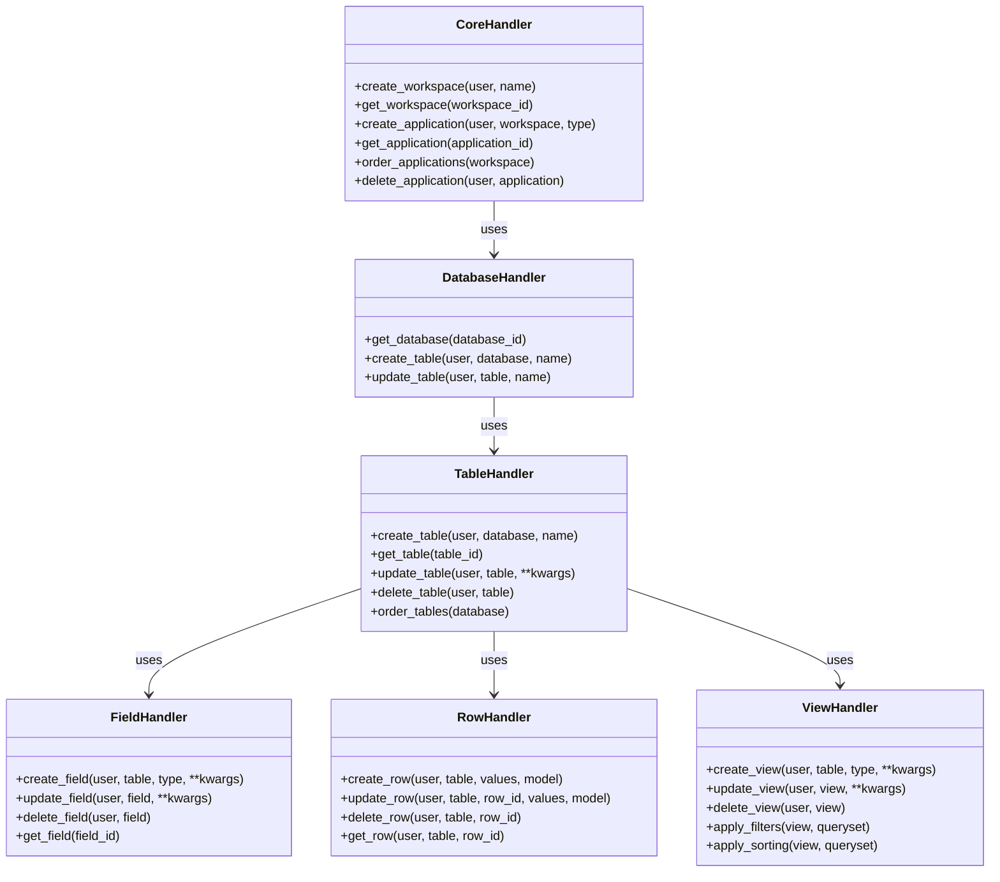
```mermaid
classDiagram
    class CoreHandler {
        +create_workspace(user, name)
        +get_workspace(workspace_id)
        +create_application(user, workspace, type)
        +get_application(application_id)
        +order_applications(workspace)
        +delete_application(user, application)
    }

    class DatabaseHandler {
        +get_database(database_id)
        +create_table(user, database, name)
        +update_table(user, table, name)
    }

    class TableHandler {
        +create_table(user, database, name)
        +get_table(table_id)
        +update_table(user, table, **kwargs)
        +delete_table(user, table)
        +order_tables(database)
    }

    class FieldHandler {
        +create_field(user, table, type, **kwargs)
        +update_field(user, field, **kwargs)
        +delete_field(user, field)
        +get_field(field_id)
    }

    class RowHandler {
        +create_row(user, table, values, model)
        +update_row(user, table, row_id, values, model)
        +delete_row(user, table, row_id)
        +get_row(user, table, row_id)
    }

    class ViewHandler {
        +create_view(user, table, type, **kwargs)
        +update_view(user, view, **kwargs)
        +delete_view(user, view)
        +apply_filters(view, queryset)
        +apply_sorting(view, queryset)
    }

    CoreHandler --> DatabaseHandler : uses
    DatabaseHandler --> TableHandler : uses
    TableHandler --> FieldHandler : uses
    TableHandler --> RowHandler : uses
    TableHandler --> ViewHandler : uses
```

---

## Frontend Architecture

### Module Organization

```mermaid
graph TB
    subgraph "Nuxt.js Application"
        subgraph "Core Module"
            CoreComponents[Components<br/>Modal, Context, Dropdown]
            CoreStore[Vuex Store<br/>auth, application, notification]
            CorePlugins[Plugins<br/>clientHandler, realtime]
            CoreMiddleware[Middleware<br/>authentication, settings]
        end

        subgraph "Database Module"
            DBComponents[Components<br/>Table, Field, Row, View]
            DBStore[Vuex Store<br/>table, field, view, filter]
            DBPages[Pages<br/>database/{id}]
        end

        subgraph "Builder Module"
            BuilderComponents[Components<br/>Page, Element, Theme]
            BuilderStore[Vuex Store<br/>page, element, dataSource]
            BuilderPages[Pages<br/>builder/{id}]
        end

        subgraph "Automation Module"
            AutoComponents[Components<br/>Workflow, Trigger, Action]
            AutoStore[Vuex Store<br/>workflow, automation]
            AutoPages[Pages<br/>automation/{id}]
        end

        subgraph "Dashboard Module"
            DashComponents[Components<br/>Widget, DataSource]
            DashStore[Vuex Store<br/>dashboard, widget]
            DashPages[Pages<br/>dashboard/{id}]
        end
    end

    CoreStore -.->|extends| DBStore
    CoreStore -.->|extends| BuilderStore
    CoreStore -.->|extends| AutoStore
    CoreStore -.->|extends| DashStore

    CoreComponents -.->|uses| DBComponents
    CoreComponents -.->|uses| BuilderComponents
    CoreComponents -.->|uses| AutoComponents
    CoreComponents -.->|uses| DashComponents

    style CoreStore fill:#d4edda
    style DBStore fill:#e1f5ff
    style BuilderStore fill:#fff4e1
    style AutoStore fill:#f8d7da
```

### Vuex Store Architecture

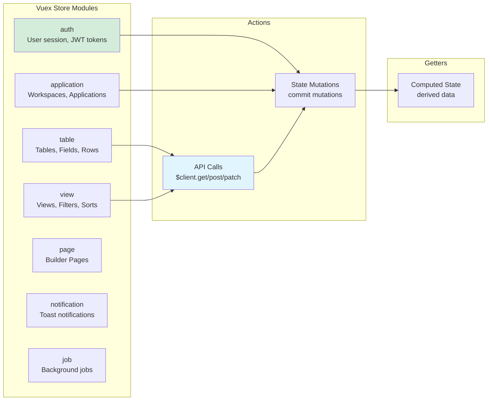
```mermaid
graph LR
    subgraph "Vuex Store Modules"
        Auth[auth<br/>User session, JWT tokens]
        Application[application<br/>Workspaces, Applications]
        Table[table<br/>Tables, Fields, Rows]
        View[view<br/>Views, Filters, Sorts]
        Page[page<br/>Builder Pages]
        Notification[notification<br/>Toast notifications]
        Job[job<br/>Background jobs]
    end

    subgraph "Actions"
        StateActions[State Mutations<br/>commit mutations]
        APIActions[API Calls<br/>$client.get/post/patch]
    end

    subgraph "Getters"
        ComputedData[Computed State<br/>derived data]
    end

    Auth --> StateActions
    Application --> StateActions
    Table --> APIActions
    View --> APIActions
    StateActions --> ComputedData
    APIActions --> StateActions

    style Auth fill:#d4edda
    style APIActions fill:#e1f5ff
```

---

## Request Flow

### REST API Request Flow

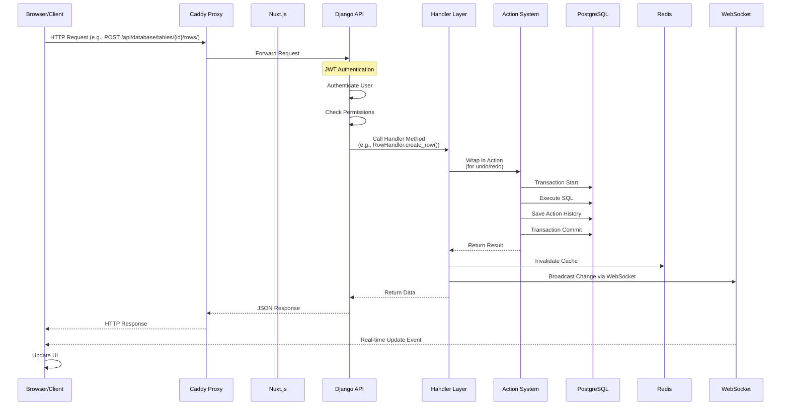
```mermaid
sequenceDiagram
    participant Client as Browser/Client
    participant Caddy as Caddy Proxy
    participant Nuxt as Nuxt.js
    participant Django as Django API
    participant Handler as Handler Layer
    participant Action as Action System
    participant DB as PostgreSQL
    participant Redis as Redis
    participant WS as WebSocket

    Client->>Caddy: HTTP Request (e.g., POST /api/database/tables/{id}/rows/)
    Caddy->>Django: Forward Request

    Note over Django: JWT Authentication
    Django->>Django: Authenticate User
    Django->>Django: Check Permissions

    Django->>Handler: Call Handler Method<br/>(e.g., RowHandler.create_row())

    Handler->>Action: Wrap in Action<br/>(for undo/redo)
    Action->>DB: Transaction Start
    Action->>DB: Execute SQL
    Action->>DB: Save Action History
    Action->>DB: Transaction Commit

    Action-->>Handler: Return Result
    Handler->>Redis: Invalidate Cache
    Handler->>WS: Broadcast Change via WebSocket
    Handler-->>Django: Return Data

    Django-->>Caddy: JSON Response
    Caddy-->>Client: HTTP Response

    WS-->>Client: Real-time Update Event
    Client->>Client: Update UI
```

### Create Table Flow (Example)

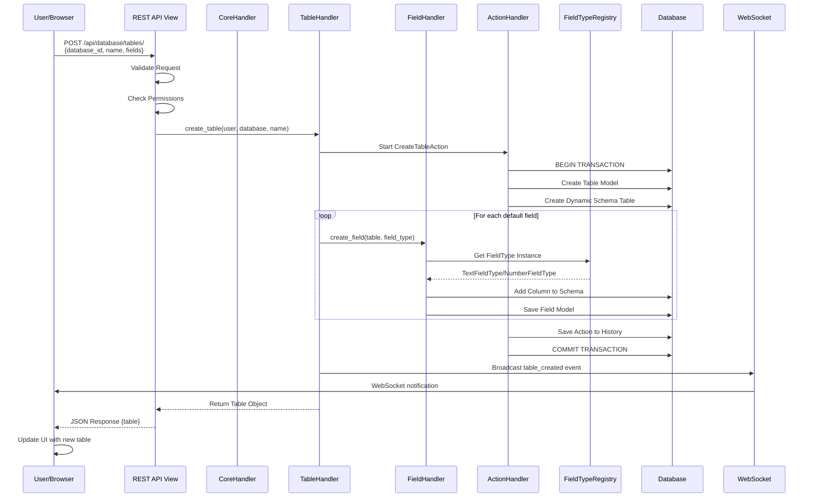
```mermaid
sequenceDiagram
    participant User as User/Browser
    participant API as REST API View
    participant Core as CoreHandler
    participant Table as TableHandler
    participant Field as FieldHandler
    participant Action as ActionHandler
    participant Registry as FieldTypeRegistry
    participant DB as Database
    participant WS as WebSocket

    User->>API: POST /api/database/tables/<br/>{database_id, name, fields}
    API->>API: Validate Request
    API->>API: Check Permissions

    API->>Table: create_table(user, database, name)
    Table->>Action: Start CreateTableAction

    Action->>DB: BEGIN TRANSACTION
    Action->>DB: Create Table Model
    Action->>DB: Create Dynamic Schema Table

    loop For each default field
        Table->>Field: create_field(table, field_type)
        Field->>Registry: Get FieldType Instance
        Registry-->>Field: TextFieldType/NumberFieldType
        Field->>DB: Add Column to Schema
        Field->>DB: Save Field Model
    end

    Action->>DB: Save Action to History
    Action->>DB: COMMIT TRANSACTION

    Table->>WS: Broadcast table_created event
    WS->>User: WebSocket notification

    Table-->>API: Return Table Object
    API-->>User: JSON Response {table}

    User->>User: Update UI with new table
```

---

## WebSocket Real-Time Communication

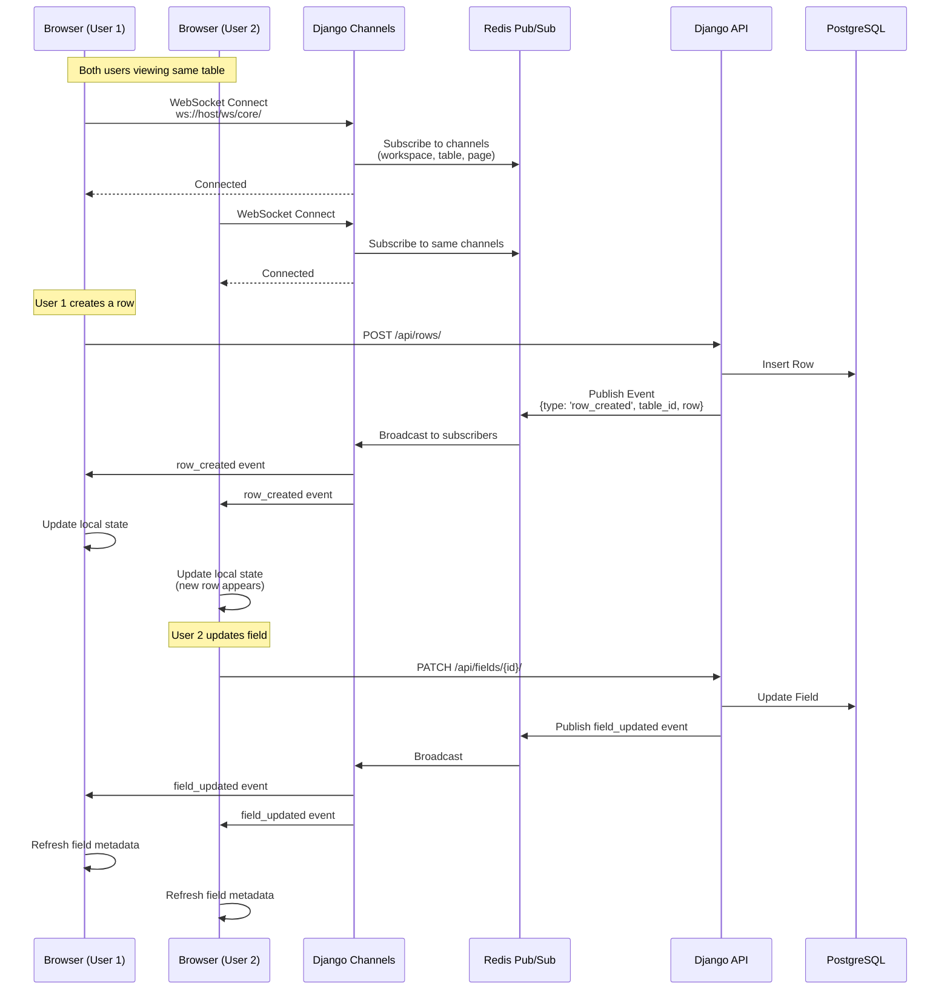
```mermaid
sequenceDiagram
    participant Client1 as Browser (User 1)
    participant Client2 as Browser (User 2)
    participant Channels as Django Channels
    participant Redis as Redis Pub/Sub
    participant Django as Django API
    participant DB as PostgreSQL

    Note over Client1,Client2: Both users viewing same table

    Client1->>Channels: WebSocket Connect<br/>ws://host/ws/core/
    Channels->>Redis: Subscribe to channels<br/>(workspace, table, page)
    Channels-->>Client1: Connected

    Client2->>Channels: WebSocket Connect
    Channels->>Redis: Subscribe to same channels
    Channels-->>Client2: Connected

    Note over Client1: User 1 creates a row
    Client1->>Django: POST /api/rows/
    Django->>DB: Insert Row
    Django->>Redis: Publish Event<br/>{type: 'row_created', table_id, row}

    Redis->>Channels: Broadcast to subscribers
    Channels->>Client1: row_created event
    Channels->>Client2: row_created event

    Client1->>Client1: Update local state
    Client2->>Client2: Update local state<br/>(new row appears)

    Note over Client2: User 2 updates field
    Client2->>Django: PATCH /api/fields/{id}/
    Django->>DB: Update Field
    Django->>Redis: Publish field_updated event

    Redis->>Channels: Broadcast
    Channels->>Client1: field_updated event
    Channels->>Client2: field_updated event

    Client1->>Client1: Refresh field metadata
    Client2->>Client2: Refresh field metadata
```

### WebSocket Event Types

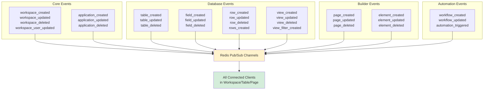
```mermaid
graph TB
    subgraph "Core Events"
        WorkspaceEvents[workspace_created<br/>workspace_updated<br/>workspace_deleted<br/>workspace_user_updated]
        ApplicationEvents[application_created<br/>application_updated<br/>application_deleted]
    end

    subgraph "Database Events"
        TableEvents[table_created<br/>table_updated<br/>table_deleted]
        FieldEvents[field_created<br/>field_updated<br/>field_deleted]
        RowEvents[row_created<br/>row_updated<br/>row_deleted<br/>rows_created]
        ViewEvents[view_created<br/>view_updated<br/>view_deleted<br/>view_filter_created]
    end

    subgraph "Builder Events"
        PageEvents[page_created<br/>page_updated<br/>page_deleted]
        ElementEvents[element_created<br/>element_updated<br/>element_deleted]
    end

    subgraph "Automation Events"
        WorkflowEvents[workflow_created<br/>workflow_updated<br/>automation_triggered]
    end

    RedisChannel[Redis Pub/Sub Channels]

    WorkspaceEvents --> RedisChannel
    ApplicationEvents --> RedisChannel
    TableEvents --> RedisChannel
    FieldEvents --> RedisChannel
    RowEvents --> RedisChannel
    ViewEvents --> RedisChannel
    PageEvents --> RedisChannel
    ElementEvents --> RedisChannel
    WorkflowEvents --> RedisChannel

    RedisChannel --> Subscribers[All Connected Clients<br/>in Workspace/Table/Page]

    style RedisChannel fill:#fff3cd
    style Subscribers fill:#d4edda
```

---

## Database Field Type System

```mermaid
graph TB
    subgraph "Field Type Registry"
        Registry[FieldTypeRegistry<br/>Singleton Instance]
    end

    subgraph "Field Type Implementations"
        TextField[TextFieldType<br/>type='text']
        NumberField[NumberFieldType<br/>type='number']
        BooleanField[BooleanFieldType<br/>type='boolean']
        DateField[DateFieldType<br/>type='date']
        LinkRowField[LinkRowFieldType<br/>type='link_row'<br/>Relationships]
        FormulaField[FormulaFieldType<br/>type='formula'<br/>Computed Values]
        LookupField[LookupFieldType<br/>type='lookup'<br/>Through Link]
        FileField[FileFieldType<br/>type='file']
        SingleSelectField[SingleSelectFieldType<br/>type='single_select']
        MultipleSelectField[MultipleSelectFieldType<br/>type='multiple_select']
    end

    subgraph "Field Type Base Class"
        BaseFieldType[FieldType Base Class]
        Methods[get_serializer()<br/>prepare_value()<br/>get_alter_column_type()<br/>get_model_field()<br/>after_create()<br/>after_update()<br/>export_serialized()<br/>import_serialized()]
    end

    Registry --> TextField
    Registry --> NumberField
    Registry --> BooleanField
    Registry --> DateField
    Registry --> LinkRowField
    Registry --> FormulaField
    Registry --> LookupField
    Registry --> FileField
    Registry --> SingleSelectField
    Registry --> MultipleSelectField

    TextField -.implements.-> BaseFieldType
    NumberField -.implements.-> BaseFieldType
    BooleanField -.implements.-> BaseFieldType
    DateField -.implements.-> BaseFieldType
    LinkRowField -.implements.-> BaseFieldType
    FormulaField -.implements.-> BaseFieldType

    BaseFieldType --> Methods

    style Registry fill:#d4edda
    style BaseFieldType fill:#fff4e1
```

### Field Creation Flow

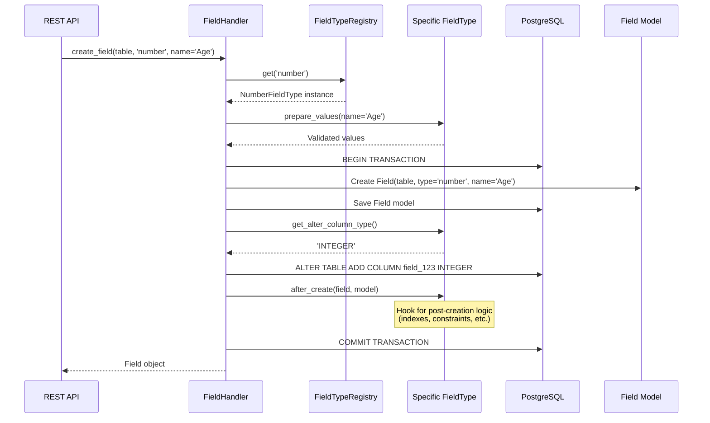
```mermaid
sequenceDiagram
    participant API as REST API
    participant Handler as FieldHandler
    participant Registry as FieldTypeRegistry
    participant FieldType as Specific FieldType
    participant DB as PostgreSQL
    participant Model as Field Model

    API->>Handler: create_field(table, 'number', name='Age')
    Handler->>Registry: get('number')
    Registry-->>Handler: NumberFieldType instance

    Handler->>FieldType: prepare_values(name='Age')
    FieldType-->>Handler: Validated values

    Handler->>DB: BEGIN TRANSACTION
    Handler->>Model: Create Field(table, type='number', name='Age')
    Handler->>DB: Save Field model

    Handler->>FieldType: get_alter_column_type()
    FieldType-->>Handler: 'INTEGER'

    Handler->>DB: ALTER TABLE ADD COLUMN field_123 INTEGER

    Handler->>FieldType: after_create(field, model)
    Note over FieldType: Hook for post-creation logic<br/>(indexes, constraints, etc.)

    Handler->>DB: COMMIT TRANSACTION
    Handler-->>API: Field object
```

---

## Action System (Undo/Redo)

The Action system wraps all state-changing operations to support undo/redo and audit history.

```mermaid
graph TB
    subgraph "Action Types"
        CreateTableAction[CreateTableAction]
        UpdateFieldAction[UpdateFieldAction]
        DeleteRowAction[DeleteRowAction]
        CreatePageAction[CreatePageAction]
        UpdateWorkspaceAction[UpdateWorkspaceAction]
    end

    subgraph "Action Base Class"
        Action[Action Base Class<br/>do() - execute action<br/>undo() - reverse action<br/>redo() - reapply action]
    end

    subgraph "Action Handler"
        ActionHandler[ActionHandler<br/>execute_action()<br/>undo()<br/>redo()]
    end

    subgraph "Action History Storage"
        DB[(Action Table<br/>user_id<br/>workspace_id<br/>action_type<br/>params<br/>timestamp)]
    end

    CreateTableAction -.implements.-> Action
    UpdateFieldAction -.implements.-> Action
    DeleteRowAction -.implements.-> Action
    CreatePageAction -.implements.-> Action
    UpdateWorkspaceAction -.implements.-> Action

    ActionHandler --> CreateTableAction
    ActionHandler --> UpdateFieldAction
    ActionHandler --> DeleteRowAction
    ActionHandler --> DB

    style Action fill:#fff4e1
    style ActionHandler fill:#d4edda
    style DB fill:#f8d7da
```

### Action Execution Flow

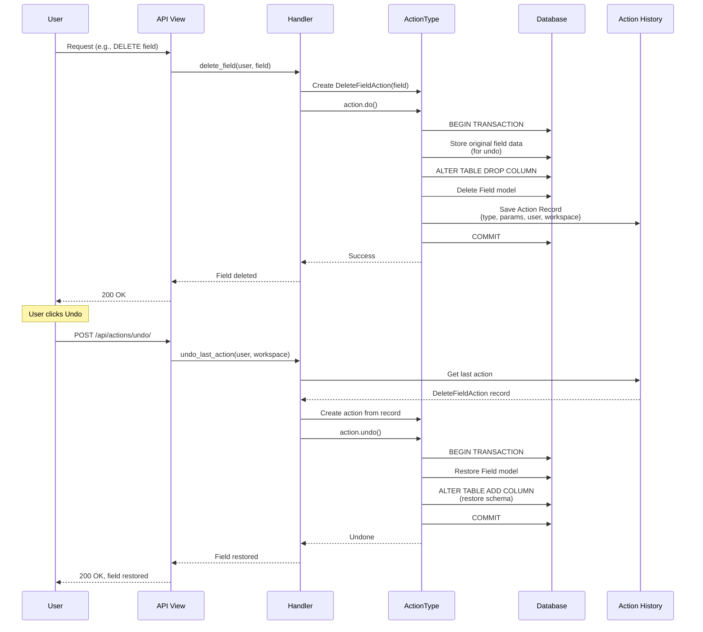
```mermaid
sequenceDiagram
    participant User as User
    participant API as API View
    participant Handler as Handler
    participant Action as ActionType
    participant DB as Database
    participant History as Action History

    User->>API: Request (e.g., DELETE field)
    API->>Handler: delete_field(user, field)

    Handler->>Action: Create DeleteFieldAction(field)
    Handler->>Action: action.do()

    Action->>DB: BEGIN TRANSACTION
    Action->>DB: Store original field data<br/>(for undo)
    Action->>DB: ALTER TABLE DROP COLUMN
    Action->>DB: Delete Field model

    Action->>History: Save Action Record<br/>{type, params, user, workspace}
    Action->>DB: COMMIT

    Action-->>Handler: Success
    Handler-->>API: Field deleted
    API-->>User: 200 OK

    Note over User: User clicks Undo
    User->>API: POST /api/actions/undo/
    API->>Handler: undo_last_action(user, workspace)
    Handler->>History: Get last action
    History-->>Handler: DeleteFieldAction record

    Handler->>Action: Create action from record
    Handler->>Action: action.undo()

    Action->>DB: BEGIN TRANSACTION
    Action->>DB: Restore Field model
    Action->>DB: ALTER TABLE ADD COLUMN<br/>(restore schema)
    Action->>DB: COMMIT

    Action-->>Handler: Undone
    Handler-->>API: Field restored
    API-->>User: 200 OK, field restored
```

---

## Plugin Architecture

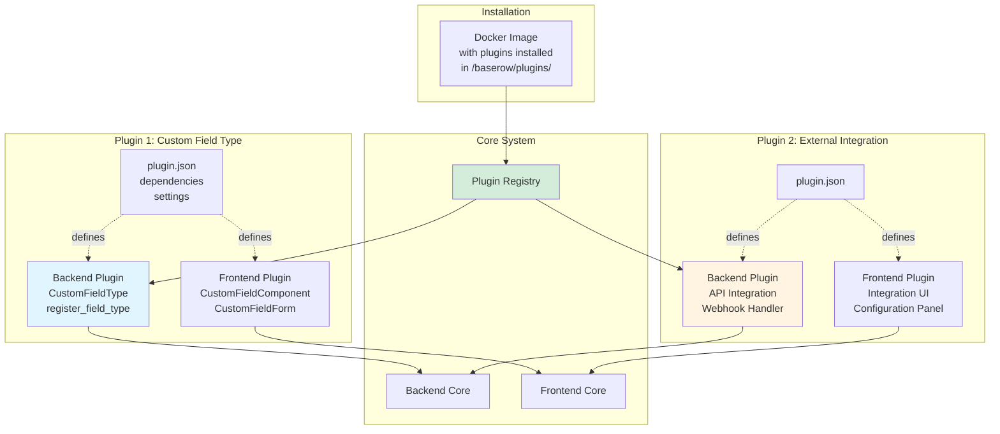
```mermaid
graph TB
    subgraph "Core System"
        PluginRegistry[Plugin Registry]
        BackendCore[Backend Core]
        FrontendCore[Frontend Core]
    end

    subgraph "Plugin 1: Custom Field Type"
        P1Backend[Backend Plugin<br/>CustomFieldType<br/>register_field_type]
        P1Frontend[Frontend Plugin<br/>CustomFieldComponent<br/>CustomFieldForm]
        P1Config[plugin.json<br/>dependencies<br/>settings]
    end

    subgraph "Plugin 2: External Integration"
        P2Backend[Backend Plugin<br/>API Integration<br/>Webhook Handler]
        P2Frontend[Frontend Plugin<br/>Integration UI<br/>Configuration Panel]
        P2Config[plugin.json]
    end

    subgraph "Installation"
        Docker[Docker Image<br/>with plugins installed<br/>in /baserow/plugins/]
    end

    Docker --> PluginRegistry
    PluginRegistry --> P1Backend
    PluginRegistry --> P2Backend
    P1Backend --> BackendCore
    P2Backend --> BackendCore

    P1Frontend --> FrontendCore
    P2Frontend --> FrontendCore

    P1Config -.defines.-> P1Backend
    P1Config -.defines.-> P1Frontend
    P2Config -.defines.-> P2Backend
    P2Config -.defines.-> P2Frontend

    style PluginRegistry fill:#d4edda
    style P1Backend fill:#e1f5ff
    style P2Backend fill:#fff4e1
```

### Plugin Registration Flow

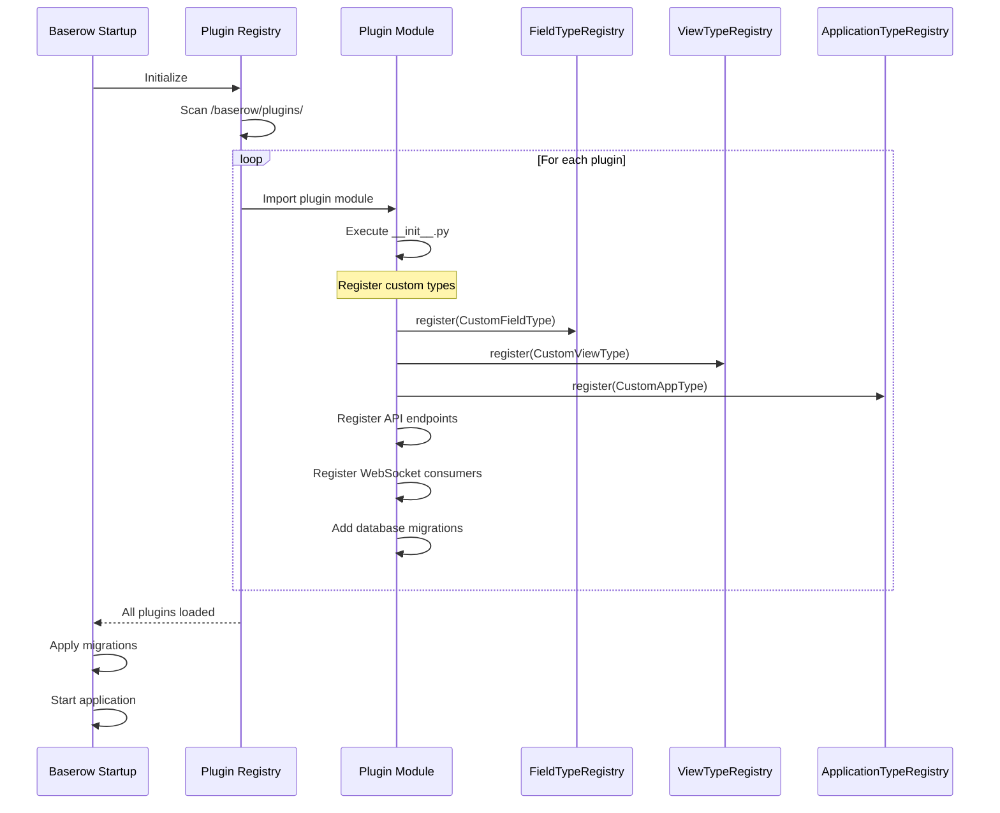
```mermaid
sequenceDiagram
    participant System as Baserow Startup
    participant PluginReg as Plugin Registry
    participant Plugin as Plugin Module
    participant FieldReg as FieldTypeRegistry
    participant ViewReg as ViewTypeRegistry
    participant AppReg as ApplicationTypeRegistry

    System->>PluginReg: Initialize
    PluginReg->>PluginReg: Scan /baserow/plugins/

    loop For each plugin
        PluginReg->>Plugin: Import plugin module
        Plugin->>Plugin: Execute __init__.py

        Note over Plugin: Register custom types
        Plugin->>FieldReg: register(CustomFieldType)
        Plugin->>ViewReg: register(CustomViewType)
        Plugin->>AppReg: register(CustomAppType)

        Plugin->>Plugin: Register API endpoints
        Plugin->>Plugin: Register WebSocket consumers
        Plugin->>Plugin: Add database migrations
    end

    PluginReg-->>System: All plugins loaded
    System->>System: Apply migrations
    System->>System: Start application
```

---

## Authentication & Authorization

### JWT Authentication Flow

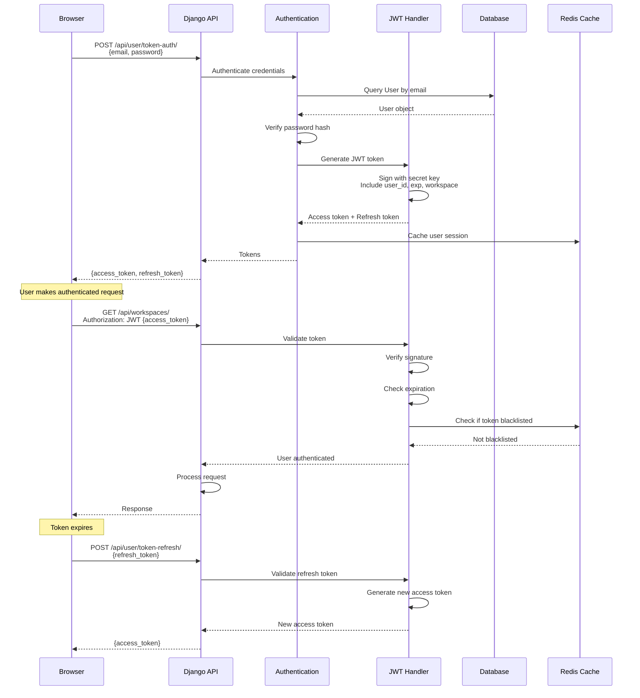
```mermaid
sequenceDiagram
    participant User as Browser
    participant API as Django API
    participant Auth as Authentication
    participant JWT as JWT Handler
    participant DB as Database
    participant Redis as Redis Cache

    User->>API: POST /api/user/token-auth/<br/>{email, password}
    API->>Auth: Authenticate credentials
    Auth->>DB: Query User by email
    DB-->>Auth: User object
    Auth->>Auth: Verify password hash

    Auth->>JWT: Generate JWT token
    JWT->>JWT: Sign with secret key<br/>Include user_id, exp, workspace
    JWT-->>Auth: Access token + Refresh token

    Auth->>Redis: Cache user session
    Auth-->>API: Tokens
    API-->>User: {access_token, refresh_token}

    Note over User: User makes authenticated request
    User->>API: GET /api/workspaces/<br/>Authorization: JWT {access_token}
    API->>JWT: Validate token
    JWT->>JWT: Verify signature
    JWT->>JWT: Check expiration

    JWT->>Redis: Check if token blacklisted
    Redis-->>JWT: Not blacklisted

    JWT-->>API: User authenticated
    API->>API: Process request
    API-->>User: Response

    Note over User: Token expires
    User->>API: POST /api/user/token-refresh/<br/>{refresh_token}
    API->>JWT: Validate refresh token
    JWT->>JWT: Generate new access token
    JWT-->>API: New access token
    API-->>User: {access_token}
```

### Permission System

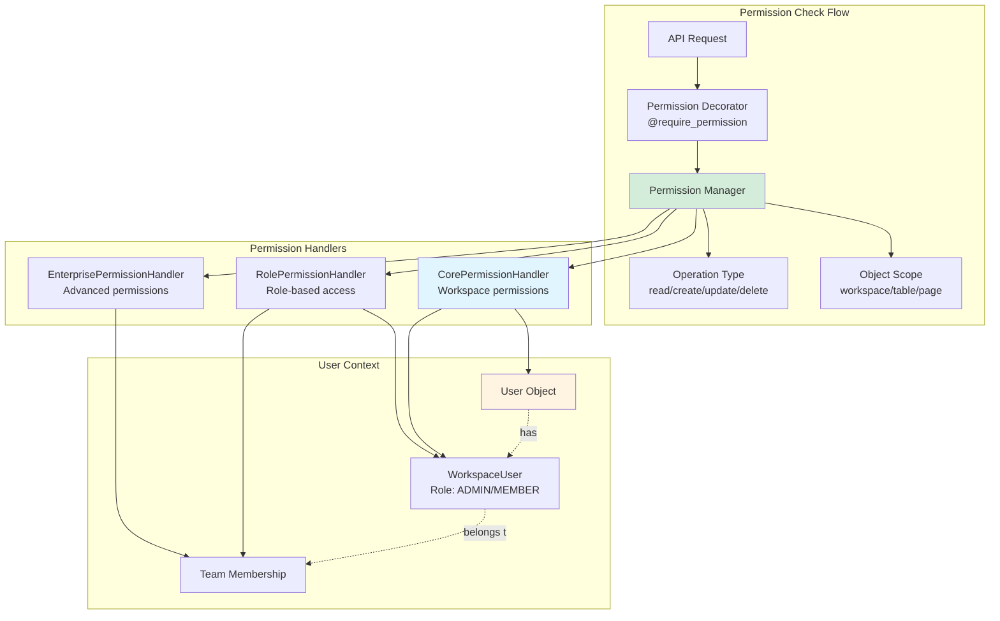
```mermaid
graph TB
    subgraph "Permission Check Flow"
        Request[API Request]
        Decorator[Permission Decorator<br/>@require_permission]
        Manager[Permission Manager]
        Scope[Object Scope<br/>workspace/table/page]
        Operation[Operation Type<br/>read/create/update/delete]
    end

    subgraph "Permission Handlers"
        CorePermission[CorePermissionHandler<br/>Workspace permissions]
        RolePermission[RolePermissionHandler<br/>Role-based access]
        EnterprisePermission[EnterprisePermissionHandler<br/>Advanced permissions]
    end

    subgraph "User Context"
        User[User Object]
        WorkspaceUser[WorkspaceUser<br/>Role: ADMIN/MEMBER]
        TeamMember[Team Membership]
    end

    Request --> Decorator
    Decorator --> Manager
    Manager --> Scope
    Manager --> Operation

    Manager --> CorePermission
    Manager --> RolePermission
    Manager --> EnterprisePermission

    CorePermission --> User
    CorePermission --> WorkspaceUser
    RolePermission --> WorkspaceUser
    RolePermission --> TeamMember
    EnterprisePermission --> TeamMember

    User -.has.-> WorkspaceUser
    WorkspaceUser -.belongs to.-> TeamMember

    style Manager fill:#d4edda
    style CorePermission fill:#e1f5ff
    style User fill:#fff4e1
```

---

## Job Queue System

Baserow uses Celery for background job processing (exports, imports, snapshots, etc.).

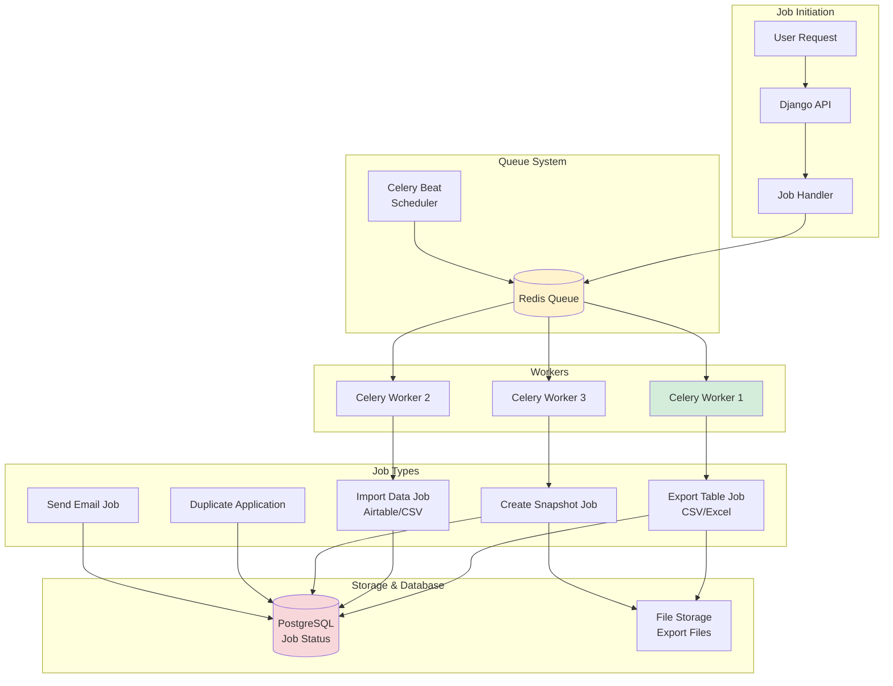
```mermaid
graph TB
    subgraph "Job Initiation"
        User[User Request]
        API[Django API]
        JobHandler[Job Handler]
    end

    subgraph "Queue System"
        Redis[(Redis Queue)]
        CeleryBeat[Celery Beat<br/>Scheduler]
    end

    subgraph "Workers"
        Worker1[Celery Worker 1]
        Worker2[Celery Worker 2]
        Worker3[Celery Worker 3]
    end

    subgraph "Job Types"
        ExportJob[Export Table Job<br/>CSV/Excel]
        ImportJob[Import Data Job<br/>Airtable/CSV]
        SnapshotJob[Create Snapshot Job]
        DuplicateJob[Duplicate Application]
        EmailJob[Send Email Job]
    end

    subgraph "Storage & Database"
        DB[(PostgreSQL<br/>Job Status)]
        FileStorage[File Storage<br/>Export Files]
    end

    User --> API
    API --> JobHandler
    JobHandler --> Redis

    Redis --> Worker1
    Redis --> Worker2
    Redis --> Worker3

    Worker1 --> ExportJob
    Worker2 --> ImportJob
    Worker3 --> SnapshotJob

    ExportJob --> DB
    ExportJob --> FileStorage
    ImportJob --> DB
    SnapshotJob --> DB
    SnapshotJob --> FileStorage
    DuplicateJob --> DB
    EmailJob --> DB

    CeleryBeat --> Redis

    style Redis fill:#fff3cd
    style Worker1 fill:#d4edda
    style DB fill:#f8d7da
```

### Job Execution Flow

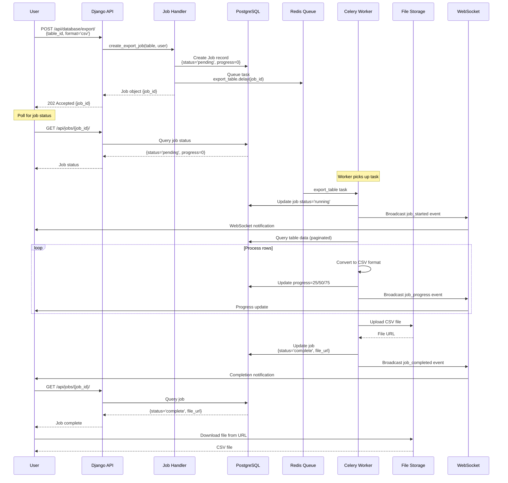
```mermaid
sequenceDiagram
    participant User as User
    participant API as Django API
    participant JobHandler as Job Handler
    participant DB as PostgreSQL
    participant Redis as Redis Queue
    participant Worker as Celery Worker
    participant Storage as File Storage
    participant WS as WebSocket

    User->>API: POST /api/database/export/<br/>{table_id, format='csv'}
    API->>JobHandler: create_export_job(table, user)

    JobHandler->>DB: Create Job record<br/>{status='pending', progress=0}
    JobHandler->>Redis: Queue task<br/>export_table.delay(job_id)
    JobHandler-->>API: Job object {job_id}
    API-->>User: 202 Accepted {job_id}

    Note over User: Poll for job status
    User->>API: GET /api/jobs/{job_id}/
    API->>DB: Query job status
    DB-->>API: {status='pending', progress=0}
    API-->>User: Job status

    Note over Worker: Worker picks up task
    Redis->>Worker: export_table task
    Worker->>DB: Update job status='running'
    Worker->>WS: Broadcast job_started event
    WS->>User: WebSocket notification

    Worker->>DB: Query table data (paginated)
    loop Process rows
        Worker->>Worker: Convert to CSV format
        Worker->>DB: Update progress=25/50/75
        Worker->>WS: Broadcast job_progress event
        WS->>User: Progress update
    end

    Worker->>Storage: Upload CSV file
    Storage-->>Worker: File URL
    Worker->>DB: Update job<br/>{status='complete', file_url}
    Worker->>WS: Broadcast job_completed event
    WS->>User: Completion notification

    User->>API: GET /api/jobs/{job_id}/
    API->>DB: Query job
    DB-->>API: {status='complete', file_url}
    API-->>User: Job complete

    User->>Storage: Download file from URL
    Storage-->>User: CSV file
```

---

## Data Flow Summary

### Create → Read → Update → Delete Flow

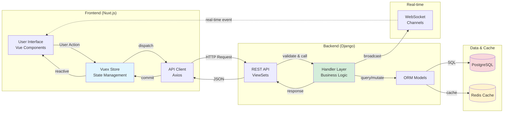
```mermaid
graph LR
    subgraph "Frontend (Nuxt.js)"
        UI[User Interface<br/>Vue Components]
        Store[Vuex Store<br/>State Management]
        Client[API Client<br/>Axios]
    end

    subgraph "Backend (Django)"
        API[REST API<br/>ViewSets]
        Handler[Handler Layer<br/>Business Logic]
        Model[ORM Models]
    end

    subgraph "Data & Cache"
        DB[(PostgreSQL)]
        Redis[(Redis Cache)]
    end

    subgraph "Real-time"
        WS[WebSocket<br/>Channels]
    end

    UI -->|User Action| Store
    Store -->|dispatch| Client
    Client -->|HTTP Request| API
    API -->|validate & call| Handler
    Handler -->|query/mutate| Model
    Model -->|SQL| DB
    Model -->|cache| Redis
    Handler -->|broadcast| WS
    WS -.->|real-time event| UI
    Handler -->|response| API
    API -->|JSON| Client
    Client -->|commit| Store
    Store -->|reactive| UI

    style DB fill:#f8d7da
    style Redis fill:#fff3cd
    style Handler fill:#d4edda
    style Store fill:#e1f5ff
```

---

## Technology Stack Summary

### Backend Stack
- **Framework**: Django 4.x + Django REST Framework
- **Real-time**: Django Channels (WebSocket)
- **Database**: PostgreSQL 12+ with pgvector extension
- **Cache & Queue**: Redis 6+
- **Task Queue**: Celery + Celery Beat
- **API Documentation**: drf-spectacular (OpenAPI 3)
- **Authentication**: JWT (djangorestframework-simplejwt)

### Frontend Stack
- **Framework**: Nuxt.js 2 (Vue.js 2)
- **State Management**: Vuex
- **HTTP Client**: Axios
- **Real-time**: WebSocket client
- **UI Components**: Custom component library
- **Styling**: SCSS with BEM methodology
- **Testing**: Jest + Vue Test Utils

### Infrastructure
- **Reverse Proxy**: Caddy Server
- **Containerization**: Docker + Docker Compose
- **File Storage**: S3-compatible or local filesystem
- **Monitoring**: OpenTelemetry (optional)
- **Logging**: Loguru (Python), console (JavaScript)

---

## Key Architectural Patterns

1. **Registry Pattern**: Extensible type system for fields, views, applications, plugins
2. **Handler Pattern**: Service layer separating business logic from API views
3. **Action Pattern**: Command pattern for undo/redo and audit trails
4. **Repository Pattern**: Database access through ORM models and handlers
5. **Pub/Sub Pattern**: WebSocket real-time updates via Redis channels
6. **Job Queue Pattern**: Async processing with Celery for long-running tasks
7. **Module Pattern**: Frontend organized into feature modules (Nuxt.js)
8. **State Management**: Centralized state with Vuex stores

---

## Conclusion

Baserow's architecture is designed for:
- **Extensibility**: Plugin system and registries allow custom types
- **Real-time Collaboration**: WebSocket broadcasting keeps all clients in sync
- **Scalability**: Stateless API servers, background workers, and Redis caching
- **Maintainability**: Clear separation of concerns with handlers and modules
- **Developer Experience**: Hot reloading, comprehensive test suites, and clear patterns

For implementation details, refer to the source code and CLAUDE.md for development guidance.
