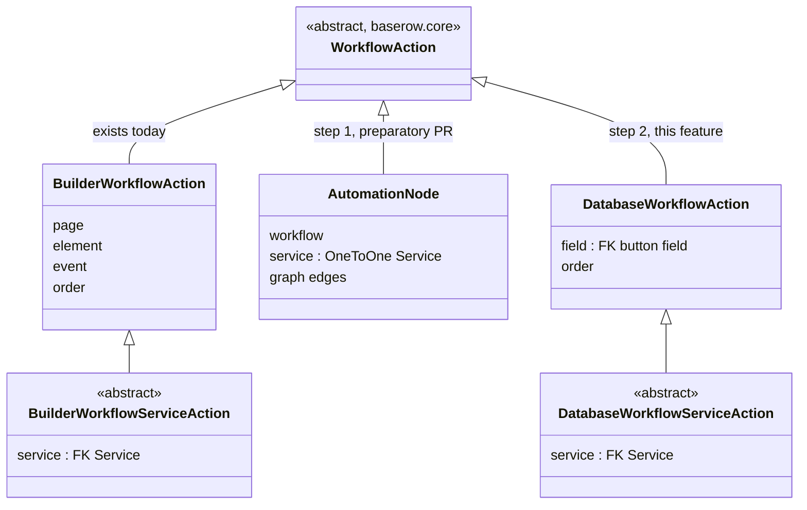
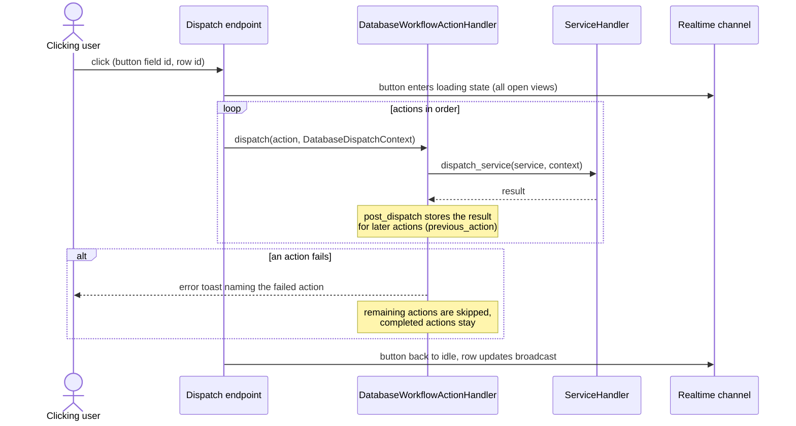
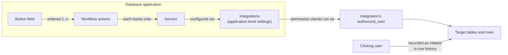
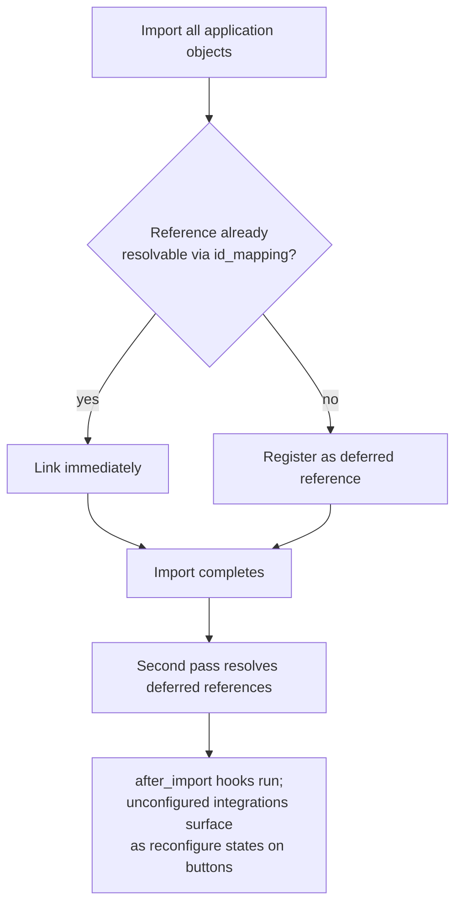

# ADR 006: How the Button Field Shares Workflow Actions Across Modules

|              |                                                |
| ------------ | ---------------------------------------------- |
| Status       | Proposed                                       |
| Date         | 2026-07-22                                     |
| Issue        | https://github.com/baserow/baserow/issues/1722 |
| Author       | Al Amin (@alamin-br)                           |
| Contributors | Davide (@silvestrid), Jérémie (@jrmi)          |

## Summary

The button field is a new database field type whose cells render a button. Clicking it
runs an ordered list of configured actions with the clicked row as context, and each
action's result available to the actions after it.

The application builder and the automation module already execute configured,
service-backed actions; the database module becomes the third consumer. This document
decides how that consumer is built: which classes are shared, how integrations reach the
database module, which user the actions run as, how import/export keeps working, and how
execution, failures, and permissions behave.

## Context

**The core base** (`baserow/core/workflow_actions`) is an abstract `WorkflowAction` with
generic mixins and no fields of its own, plus a registry base and a generic CRUD
handler. It contains no execution logic; its job is to keep the module implementations
consistent so they can be merged later.

**The builder** (`contrib/builder/workflow_actions`) subclasses it.
`BuilderWorkflowAction` holds page, element, event, and order; the `service` foreign key
sits on the abstract `BuilderWorkflowServiceAction`, because action types come in two
kinds: service-backed ones (thin shells forwarding to
`ServiceHandler().dispatch_service()`) and frontend-only ones (notification, open page,
logout, refresh data source) that never reach the backend. After each dispatch, data
providers get a `post_dispatch()` hook, which is how `previous_action` results reach
later actions.

**Automation** (`contrib/automation/nodes`) did not reuse the core base:
`AutomationNode` holds a `OneToOneField(Service)` and executes as a graph. Review
established there was no technical blocker behind that: the team was unsure the base
would fit and never came back to it. Adopting it now is mostly an inheritance change.

Three constraints shape everything below:

- Integrations are application-level objects, and the database application type does not
  support them today. Enabling the flag is one line; import/export, duplication, and
  templates are the real work.
- Local Baserow services run every permission check as the integration's
  `authorized_user`, by default its creator. Reused unchanged, a click would be
  attributed to whoever configured the field, not whoever clicked.
- Cross-application import order (databases first) cannot help an integration that lives
  in the database application and references its own tables.

## Decision

### 1. Model layer: converge on the core base, mirror the builder

1. A small preparatory PR, offered by the automation team, makes automation adopt the
   core `workflow_actions` base classes, removing the one existing divergence.
2. The database module mirrors `contrib/builder/workflow_actions` with database concepts
   substituted: `DatabaseWorkflowAction` (foreign key to the button field, `order`),
   abstract `DatabaseWorkflowServiceAction` holding the `service` foreign key, a type
   registry, and a handler and service layer that enforce permissions.

The core base contains no behavior, so step 2 re-implements a thin layer rather than
reusing code; the heavy machinery in `core/services` and `contrib/integrations` is used
as is. Keeping all three modules the same shape is what makes merging them into one
shared implementation cheap later. Generalizing the builder's dispatch process to serve
both modules is a promising follow-up with the builder team, not a prerequisite.

### 2. Action types: service-backed first, frontend actions kept possible

The first version registers service-backed types only: create, update, and delete
row(s), backed by the existing Local Baserow services. External types (HTTP request,
SMTP email, Slack) and code execution follow later, with the same premium or enterprise
licensing those services already have elsewhere.

Frontend-only actions (success toast, navigate to a URL or table, apply a temporary
filter) will likely be wanted later. The `service` foreign key therefore goes on the
abstract `DatabaseWorkflowServiceAction`, exactly as in the builder, so frontend-only
types can be added later without a schema migration.

### 3. Execution flow and failure behavior

A dispatch endpoint receives the click, builds a `DatabaseDispatchContext`, and
dispatches the actions in order. State changes are broadcast over the existing row
realtime channel, as the AI field already does, so every open view sees the loading
state.

Failure behavior matches the builder: execution stops at the first failing action, the
rest are skipped, and the user sees an error toast. Nothing is rolled back, since
sequences can contain irreversible effects (an email cannot be unsent). Retries,
on-error action stacks, and per-click run history are out of scope.

Local row actions dispatch synchronously in the request. Slow external actions later
move behind the existing job/Celery pattern with realtime completion, so the API treats
"dispatched" and "completed" as separate states from the start.

### 4. Row context and result chaining

The database module registers two data providers for button dispatch:

- **A raw row provider** exposing the clicked row's values with their real types. The AI
  field's `HumanReadableFieldsDataProviderType` is not reused for this: it stringifies
  every value, which is right for prompt text and wrong for writing numbers, dates, or
  links into rows.
- **A previous-action provider** modeled on the builder's `PreviousActionProviderType`
  and automation's `PreviousNodeProviderType`, with identifier remapping on import, so
  all three modules keep the same design.

### 5. Integrations and ownership

The database application type enables `supports_integrations`. Integrations stay
application-level objects managed in a settings modal patterned on the builder's, and
behave the same under duplication, export/import, and snapshots. Per-field integration
configuration was considered and rejected: it fragments credential management and
diverges from every other module; a field-level shortcut can still open the same
application-level objects.

**Which user do actions run as, and who is the change attributed to?** These are two
separate questions, and the first version answers them separately.

Permission checks keep the builder and automation behavior: services run as the
integration's `authorized_user`. This is what lets a button run predefined actions the
clicking user could not do directly, which is the point of the field, and it is guarded
by who may configure it. The action editor offers the tables the integration's user can
reach, and if that user loses access to a target table, clicks fail with the standard
error toast rather than silently skipping.

Attribution does not follow that rule, because the database is stricter here than the
builder. Row history is a feature every collaborator sees; if a click shows up as an
edit by whoever configured the integration, the database shows wrong information in a
core UI. The builder never surfaces this, since its end users see no row history. The
dispatch context therefore carries the clicking user as the initiator, and row changes
made by button actions record the initiator in row history from the first version. This
works in v1 because every click comes from an authenticated editor or above (section 7);
anonymous initiators only become a question if buttons ever reach public views.

The planned Agent feature (virtual users for integrations) changes who the authorized
user is, not this attribution decision; how the audit log evolves is left to that work.

### 6. Import, export, duplication, and sharing

Table and field ids inside service configurations and previous-action references remap
through the standard `id_mapping` on import, as builder services already do. The hard
case is ordering: an integration inside a database can point at tables of that same
database, which do not exist yet mid-import. The builder has the same problem with
formulas and solves it in two passes: import everything, register the references that
cannot be resolved yet, and resolve them once the import completes. We reuse that
mechanism.

Exports and templates strip sensitive integration fields, as today. The Local Baserow
integration self-heals: `after_import` rebinds `authorized_user` to the importing user.
External integrations cannot; their buttons render disabled with an error indicator
pointing at the integration to reconfigure. The builder needs the same reconfigure
experience; both modules should share one solution.

### 7. What kind of field is a button, and who may click it

A button is not a read-only field in the current sense (a server-computed column). It
stores no cell value, is interactive, and users may eventually have different rights to
it. Concretely:

- No stored value; no filtering, sorting, or grouping.
- Row write endpoints reject it through the same path as read-only fields, but the API
  documentation describes it as an action field, not a computed one.
- Clicking is a distinct operation on the dispatch endpoint, where permissions attach:
  editor role minimum, disabled in public views and for viewers and commenters, enforced
  backend-side.
- A future per-field "who can click" permission (a role-based permission on that
  endpoint) fits without rework; it is out of scope for the first version.

### 8. Behavior under common operations

- **Field duplication.** Actions and services are duplicated; both fields point at the
  same application-level integrations.
- **Application duplication, snapshot, export/import.** Integrations are copied with the
  application; deferred resolution reconnects self-references; stripped credentials must
  be reconfigured (Local Baserow self-heals).
- **Trash and restore.** Actions and services follow the field, as builder actions
  follow their element.
- **Field type conversion.** Converting away deletes actions and services; converting
  into a button starts empty. Both directions are destructive, like other fields that
  carry configuration.
- **Undo/redo.** Configuration changes are undoable like other field updates. Clicks are
  never undoable, even when a sequence only touches rows: a partially undoable button is
  more confusing than none.
- **Deleting the integration's user.** The Local Baserow integration cascades away;
  services survive with a null integration and the buttons enter the reconfigure state.
- **Failure mid-sequence.** Execution stops, later actions are skipped, completed
  actions stay, and the user sees an error toast (section 3).

## Options considered for the model layer

### Option 1: `DatabaseWorkflowAction` mirroring the builder (chosen)

Database-scoped subclass of the core base, mirroring `contrib/builder/workflow_actions`,
preceded by the automation convergence PR.

- Pro: a proven pattern that fits the button exactly; no cross-team refactor; database
  depends only on core.
- Con: the thin module layer is re-implemented a third time (small: builder action types
  are mostly empty shells around shared services); execution consolidation is deferred,
  not solved.

### Option 2: node/service model, following the automation pattern

An ordered list of records each holding a `OneToOneField(Service)`, like
`AutomationNode`, skipping the `WorkflowAction` base.

- Pro: matches automation's "every node is a service" invariant.
- Con: `AutomationNode` is coupled to workflows and graph traversal a flat list does not
  need; it rules out frontend-only action types; and it diverges from the core base just
  as bringing automation onto it becomes nearly free.

### Option 3: extract a shared action-sequence abstraction into core first

Refactor core to own ordered service-backed execution with context chaining, port
builder and automation, then build the button field on top.

- Pro: one implementation instead of three; future consumers become cheap.
- Con: a large cross-team refactor with migration risk, blocking the feature on work
  with no user-facing value, before the third real consumer exists to show what the
  right abstraction is.

The chosen path is Option 1 plus the cheap part of Option 3: unify the base classes now,
defer unifying execution until a real need appears.

## Consequences

- The button field ships without waiting on a cross-team refactor; the only upstream
  dependency is the small automation inheritance change.
- The database module gains integrations, the largest work item here (settings UI,
  import/export handling, reconfigure states) and the main schedule risk.
- Row history records the clicking user as the initiator from the first version, so the
  database never shows wrong attribution.
- Until a merge is justified, three similar thin layers exist side by side; the shared
  base classes keep them cheap to unify.

## Revisit triggers

- A fourth consumer appears, or buttons need branching/routers: extract the shared
  execution abstraction (Option 3) instead of copying a fourth time.
- The Agent feature lands: revisit which user button integrations run as and how clicks
  appear in the audit log.
- Frontend-only button actions are prioritized: design the shared dispatch mechanism
  with the builder team before building one alone.
