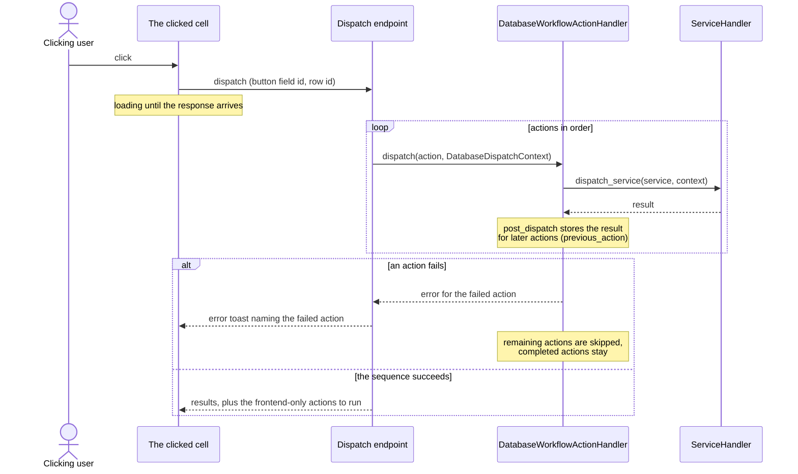
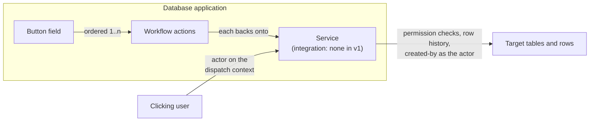
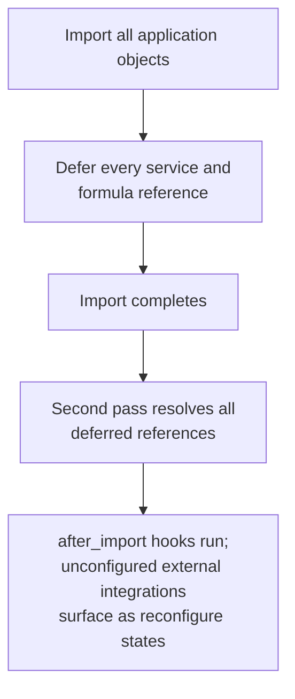

# ADR 006: How the Button Field Shares Workflow Actions Across Modules

|              |                                                |
| ------------ | ---------------------------------------------- |
| Status       | Accepted                                       |
| Date         | 2026-07-22                                     |
| Issue        | https://github.com/baserow/baserow/issues/1722 |
| Author       | Al Amin (@alamin-br)                           |
| Contributors | Davide (@silvestrid), Jérémie (@jrmi)          |

## Summary

The button field is a new database field type whose cells render a button. Clicking it
runs an ordered list of configured actions with the clicked row as context, and each
action's result available to the actions after it.

The application builder and the automation module already execute configured,
service-backed actions; the database module becomes the third consumer. This document
decides how that consumer is built: which classes are shared, how integrations reach the
database module, which user the actions run as, how import/export keeps working, and how
execution, failures, and permissions behave.

## Context

**The core base** (`baserow/core/workflow_actions`) is an abstract `WorkflowAction` with
generic mixins and no fields of its own, plus a registry base and a generic CRUD
handler. It contains no execution logic; its job is to keep the module implementations
consistent so they can be merged later.

**The builder** (`contrib/builder/workflow_actions`) subclasses it.
`BuilderWorkflowAction` holds page, element, event, and order; the `service` foreign key
sits on the abstract `BuilderWorkflowServiceAction`, because action types come in two
kinds: service-backed ones (thin shells forwarding to
`ServiceHandler().dispatch_service()`) and frontend-only ones (notification, open page,
logout, refresh data source) that never reach the backend. After each dispatch, data
providers get a `post_dispatch()` hook, which is how `previous_action` results reach
later actions.

**Automation** (`contrib/automation/nodes`) did not reuse the core base:
`AutomationNode` holds a `OneToOneField(Service)` and executes as a graph. Review
established there was no technical blocker behind that: the team was unsure the base
would fit and never came back to it. Adopting it now is mostly an inheritance change.

Three constraints shape everything below:

- Integrations are application-level objects, and the database application type does not
  support them today. Enabling the flag is one line; import/export, duplication, and
  templates are the real work.
- Local Baserow services run every permission check as the integration's
  `authorized_user`, by default its creator. Reused unchanged, a click would be
  attributed to whoever configured the field, not whoever clicked.
- Cross-application import order (databases first) cannot help services that live in the
  database application and reference that same database's tables.

## Decision

### 1. Model layer: converge on the core base, mirror the builder

1. A small PR, offered by the automation team, makes automation adopt the core
   `workflow_actions` base classes, removing the one existing divergence. It lands in
   parallel; nothing in the database work waits on it.
2. The database module mirrors `contrib/builder/workflow_actions` with database concepts
   substituted: `DatabaseWorkflowAction` (foreign key to the button field, `order`),
   abstract `DatabaseWorkflowServiceAction` holding the `service` foreign key, a type
   registry, and a handler and service layer that enforce permissions.

The core base contains no behavior, so the database module adds its own thin glue layer;
the heavy machinery in `core/services` and `contrib/integrations` is used as is. Keeping
all three modules the same shape is what makes merging them into one shared
implementation cheap later. Generalizing the builder's dispatch process to serve both
modules is a promising follow-up with the builder team, not a prerequisite.

### 2. Action types: service-backed first, frontend actions kept possible

The first version registers service-backed types only: create, update, and delete
row(s), backed by the existing Local Baserow services. External types (HTTP request,
SMTP email, Slack) and code execution follow later, with the same premium or enterprise
licensing those services already have elsewhere.

Frontend-only actions (success toast, navigate to a URL or table, apply a temporary
filter) will likely be wanted later. The `service` foreign key therefore goes on the
abstract `DatabaseWorkflowServiceAction`, exactly as in the builder, so frontend-only
types can be added later without a schema migration.

Phase 1's `url_formula` field attribute was scaffolding, not part of the end state. It
existed because the button shipped before the action layer. That layer has since arrived:
opening a URL is a frontend-only `open_url` action like any other, a data migration turns
every existing `url_formula` into one, and nothing reads the attribute any more. The
column itself stays on `ButtonField` as deprecated under the zero-downtime rule, to be
dropped in a later release. A button never carries both a `url_formula` and an action
list, and nothing is designed around them coexisting.

The builder's `open_page` is the working precedent, not just an analogy. Its `custom`
navigation branch already stores its target as a formula object, the same shape as
`url_formula`, so the action type had an implementation to mirror rather than invent.

The client does not, however, run a frontend-only action on its own. A click always calls
the dispatch endpoint; the endpoint dispatches the service-backed actions, skips the
frontend-only ones, and hands them back under a `client_actions` key for the browser to
execute once the response arrives. This is where the database diverges from the builder,
which does execute its notification and open-page actions without a round trip.
Implementation established why: running the two kinds in list order would need one
dispatch call per contiguous run of service-backed actions, and the click lock is keyed on
`(field_id, row_id)`, so every call after the first would be rejected with 409. Returning
the whole frontend tail in one response avoids that, and it buys a second property that
matters now that **same tab** is the default target: a failing action raises before the
response is built, so `client_actions` never reaches the browser and the navigation does
not happen, leaving the user on the error toast rather than carrying them away from it.
The cost is that a frontend-only action always runs after every service-backed one,
whatever its position in the list.

Public views are not part of that reasoning. An earlier draft of this section argued the
client-side path preserved the phase-1 behaviour of a URL button working in a publicly
shared view. That is no longer true and no longer wanted: phase 1 review concluded button
fields should not appear in public views at all, and `ButtonFieldType` now sets
`can_be_in_public_view = False`. There is no public-view button left to preserve, so
nothing in the action design should be shaped around one. Section 7's rule is the whole
story: buttons are unavailable to anonymous users, whether or not their actions reach the
server.

### 3. Execution flow and failure behavior

A dispatch endpoint receives the click, builds a `DatabaseDispatchContext`, and
dispatches the actions in order. The loading state belongs to the person who clicked:
their own cell shows it until the response arrives, and ignores further clicks meanwhile.

An earlier draft of this section broadcast that loading state to every open view over the
row realtime channel, the way the AI field does. That was descoped on 2026-07-28 and now
belongs to phase 4. Local dispatch is synchronous, so the clicking user has the outcome in
the response, and other viewers see the row changes arrive through the normal row-update
signals; between the two there is nothing for a concurrent viewer to watch. A broadcast
loading state is built when external actions make a dispatch slow enough for that gap to
be worth showing, which is also when the job/Celery pattern arrives.

Failure behavior matches the builder: execution stops at the first failing action, the
rest are skipped, and the user sees an error toast. Nothing is rolled back, since
sequences can contain irreversible effects (an email cannot be unsent). Retries,
on-error action stacks, and per-click run history are out of scope, and so is rate
limiting until external action types arrive.

Dispatch is serialized per button cell: while a click is running, the endpoint rejects
further clicks for the same field and row, so a double click cannot run a sequence
twice. Row changes made by actions fire the normal side effects (webhooks, automation
triggers, realtime updates), the same as a manual edit; buttons add no loop guard of
their own beyond what automation already applies to its triggers.

Local row actions dispatch synchronously in the request. Slow external actions later
move behind the existing job/Celery pattern with realtime completion, so the API treats
"dispatched" and "completed" as separate states from the start.

### 4. Row context and result chaining

The database module registers two data providers for button dispatch:

- **A raw row provider** exposing the clicked row's values with their real types. The AI
  field's `HumanReadableFieldsDataProviderType` is not reused for this: it stringifies
  every value, which is right for prompt text and wrong for writing numbers, dates, or
  links into rows.
- **A previous-action provider** modeled on the builder's `PreviousActionProviderType`
  and automation's `PreviousNodeProviderType`, with identifier remapping on import, so
  all three modules keep the same design.

The raw row provider is a snapshot taken at dispatch time: every action sees the row as
it was when the user clicked, even after an earlier action changed or deleted it;
fresher values come from the previous-action provider. Like the builder's, both
providers are implemented on backend and frontend, so the action editor's data explorer
and the dispatch path see the same shapes.

### 5. Integrations and ownership

**Actions run as the user who clicks.** Permission checks, row history, created-by
fields, and the audit log all see the clicking user, and a click fails with the standard
error toast if that user lacks permission on a target table. The same rule holds per
field: an action that would write a field the clicker cannot write fails, rather than
silently skipping that field the way the builder's upsert does today. There is no way to
run an action on someone else's behalf: a button is a shortcut for things the clicker
could already do, not a way to do more.

This is a deliberate break from the builder and automation, where services run every
check as the integration's `authorized_user`. That model exists because builder end
users are usually not Baserow users at all. Database clickers are the opposite: always
logged-in collaborators with at least the editor role (section 7). Reusing the
on-behalf-of model here would put the wrong name in row history and created-by fields,
and would let anyone who can edit a field use the integration to reach every table its
user can reach. Neither is acceptable in a database.

Database buttons need no Local Baserow integration. That integration exists only to
carry a user for services that act inside Baserow, and for a button that user is the
clicker. The dispatch context carries the clicking user as the `actor`, and it flows
down to the services:

- No integration attached, which is every database button in v1: the service authorizes
  and executes as the actor, and fails if there is none.
- Integration present, which is the builder, automation, and any future opt-in:
  `authorized_user` authorizes, unchanged. Also recording the actor for auditing in this
  branch is future work owned by the builder and automation teams, since today's
  pipeline carries a single user; nothing in v1 depends on it.

Whether "no integration attached" is modeled as a nullable foreign key on the service or
as a small purpose-built object with the same interface is an implementation choice, not
made here. The architectural commitment is only that a database click never depends on
an integration's user.

This decision covers only Local Baserow services. External integrations (SMTP, Slack,
and the rest) carry real configuration rather than a stand-in user, so their services
keep requiring them: an email action will need an `SMTPIntegrationType` integration when
external action types arrive (section 2). How those integrations are shared is
deliberately not settled here. Review flagged that application-level sharing, the
current builder model, lets any builder attach someone else's credentials to their own
button and act as them, for example sending email from the creator's account.
Integrations today have no ownership at all, and review agreed on a sequence for fixing
that. When external integrations arrive, every integration states explicitly who can
reuse it, extending the warning the builder already shows at authorization time. A later
iteration adds real ownership: a `created_by` user and an `is_shared` flag, private by
default. Both steps are designed with the builder team, since they apply to its
integrations as much as to buttons.

In practice v1 registers only local row actions, so it has nothing to auto-create, copy,
or manage, and no integrations settings UI. The builder keeps its behavior: a builder
service without an integration is a normal half-configured state that fails cleanly
today, and it keeps failing that way, because only a dispatch context that supplies an
actor takes the no-integration path. If the database ever exposes attaching a Local
Baserow integration to a button action, that attachment is the explicit opt-in back into
on-behalf-of execution (see the revisit triggers).

Clicks stay non-undoable (section 8), and that takes one deliberate step: dispatch
performs the row actions without registering them in the clicker's undo session, while
still firing the `action_done` signal that row history and the audit log listen to.
Without that step the clicker's session id, which arrives on every authenticated
request, would put every click in their undo stack.

Configuration keeps the existing field boundary: creating a button field and editing its
actions follow field update permissions, so the builder role and above. The action
editor offers the tables the configuring user can reach, and the same check happens
again at click time as the clicker, so a configuration made by someone with broader
access cannot give anyone extra access.

### 6. Import, export, duplication, and sharing

Table and field ids inside service configurations and previous-action references remap
through the standard `id_mapping` on import, as builder services already do. The hard
case is ordering: a service inside a database can point at tables of that same database,
which do not exist yet mid-import. The builder has the same problem with formulas and
solves it with a second pass; that machinery is builder-internal, so the database
follows the same pattern inside its own deferred import machinery: import all objects
first, defer every service and formula reference without checking whether it could
already resolve (some references live inside formulas, so checking up front is
unreliable anyway), then resolve them all once the import completes.

The second pass is flat and needs no dependency ordering. Everything a button's actions
reference is a table, field, or view, and all of those exist after the first pass. No
button needs anything produced by another button: buttons store no cell value, actions
cannot write to them, and previous-action references stay inside one field's own ordered
list. An action type that breaks this rule must change this document first.

In v1 there is nothing to strip and nothing to reconfigure, because database services
have no integration. When external integrations arrive, exports strip their credentials
as today, and their buttons render disabled with an error indicator pointing at the
integration to reconfigure, reusing the error state the builder already shows for
misconfigured actions rather than inventing a database-specific one.

**Constraint discovered in implementation.** Actions are serialized from
`FieldType.export_serialized`, which receives only the field: no `files_zip`, no
`storage`, and no `import_export_config`. The action export path therefore cannot carry
files, and cannot apply `exclude_sensitive_data`. This is harmless in v1, since Local
Baserow services have neither files nor credentials. It does mean the commitment above
that "exports strip their credentials as today" cannot be honoured through this path
once external integrations arrive; widening `FieldType.export_serialized` to take the
same arguments the builder's export path already receives is a prerequisite for that
work.

### 7. What kind of field is a button, and who may click it

A button is not a read-only field in the current sense (a server-computed column). It
stores no cell value, is interactive, and users may eventually have different rights to
it. Concretely:

- No stored value; no filtering, sorting, or grouping.
- Row write endpoints reject it through the same path as read-only fields, but the API
  documentation describes it as an action field, not a computed one.
- Clicking is a distinct operation on the dispatch endpoint, where permissions attach:
  editor role minimum, disabled in public views and for viewers and commenters, enforced
  backend-side.
- The dispatch endpoint accepts user sessions only; database API tokens cannot click in
  the first version, since a token has no role or identity to record.
- A future per-field "who can click" permission (a role-based permission on that
  endpoint) fits without rework; it is out of scope for the first version.

### 8. Behavior under common operations

- **Field duplication.** Actions and services are duplicated with the field.
- **Application duplication, snapshot, export/import.** Deferred resolution reconnects
  self-references; stripped credentials only become a concern when external integrations
  arrive.
- **Trash and restore.** Actions and services follow the field, as builder actions
  follow their element.
- **Deleting or trashing a target table or field.** Services keep the dangling reference
  and the button enters the reconfigure state rather than failing only at click time;
  restoring from trash heals it without reconfiguration.
- **Field type conversion.** Converting away deletes actions and services; converting
  into a button starts empty. Both directions are destructive, like other fields that
  carry configuration.
- **Undo/redo.** Configuration changes are undoable like other field updates. Clicks are
  never undoable, even when a sequence only touches rows: a partially undoable button is
  more confusing than none.
- **Deleting a user.** Nothing breaks: actions run as whoever clicks, and v1 services
  have no integration, so no button depends on any particular account.
- **Failure mid-sequence.** Execution stops, later actions are skipped, completed
  actions stay, and the user sees an error toast (section 3).

## Options considered for the model layer

### Option 1: `DatabaseWorkflowAction` mirroring the builder (chosen)

Database-scoped subclass of the core base, mirroring `contrib/builder/workflow_actions`,
preceded by the automation convergence PR.

- Pro: a proven pattern that fits the button exactly; no cross-team refactor; database
  depends only on core.
- Con: a third thin glue layer to maintain (registrations and empty shells around shared
  services, no real logic duplicated); execution consolidation is deferred, not solved.

### Option 2: node/service model, following the automation pattern

An ordered list of records each holding a `OneToOneField(Service)`, like
`AutomationNode`, skipping the `WorkflowAction` base.

- Pro: matches automation's "every node is a service" invariant.
- Con: `AutomationNode` is coupled to workflows and graph traversal a flat list does not
  need; it rules out frontend-only action types; and it diverges from the core base just
  as bringing automation onto it becomes nearly free.

### Option 3: extract a shared action-sequence abstraction into core first

Refactor core to own ordered service-backed execution with context chaining, port
builder and automation, then build the button field on top.

- Pro: one implementation instead of three; future consumers become cheap.
- Con: a large cross-team refactor with migration risk, blocking the feature on work
  with no user-facing value, before the third real consumer exists to show what the
  right abstraction is.

The chosen path is Option 1 plus the cheap part of Option 3: unify the base classes now,
defer unifying execution until a real need appears.

## Consequences

- The button field ships without waiting on a cross-team refactor; the only upstream
  dependencies are the `actor` property on the dispatch context and making the
  integration unnecessary for database services (section 5). The core side is mostly in
  place already (the service's integration foreign key is nullable and a
  `requires_integration` hook exists); the real work is the actor fallback in the Local
  Baserow service types, a handful of dispatch paths shared with the builder and
  automation and reviewed with those teams. The automation inheritance change lands in
  parallel and blocks nothing.
- v1 needs no integrations at all, since local row actions run as the actor; external
  action types bring their own integrations later. Import/export of self-referencing
  services remains the main schedule risk; the settings UI, credential handling, and
  reconfigure states move entirely to the version that adds external action types.
- Actions are authorized and attributed as the clicking user, so permissions, row
  history, and created-by fields are always right, with no on-behalf-of machinery.
- Until a merge is justified, three similar thin layers exist side by side; the shared
  base classes keep them cheap to unify.

## Revisit triggers

- A fourth consumer appears, or buttons need branching/routers: extract the shared
  execution abstraction (Option 3) instead of copying a fourth time.
- Buttons reach public views: anonymous clicks would need an explicit opt-in that
  attaches a Local Baserow integration to the action, reopening on-behalf-of execution
  with the integration's user.
- External integration types are scheduled: ship them with explicit sharing warnings on
  every integration, and plan the ownership iteration (`created_by` plus `is_shared`,
  private by default) with the builder team (section 5).
- A second frontend-only button action is prioritized: `open_url` shipped with a
  client-side dispatch mechanism of its own (section 2), so the next one is the moment to
  design a shared one with the builder team rather than copy it a third time.
