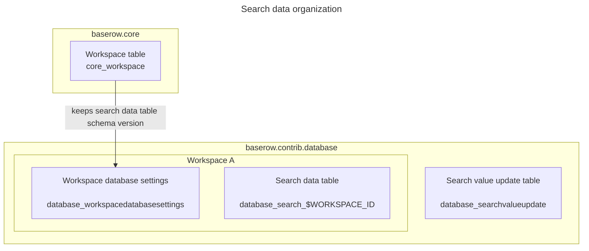
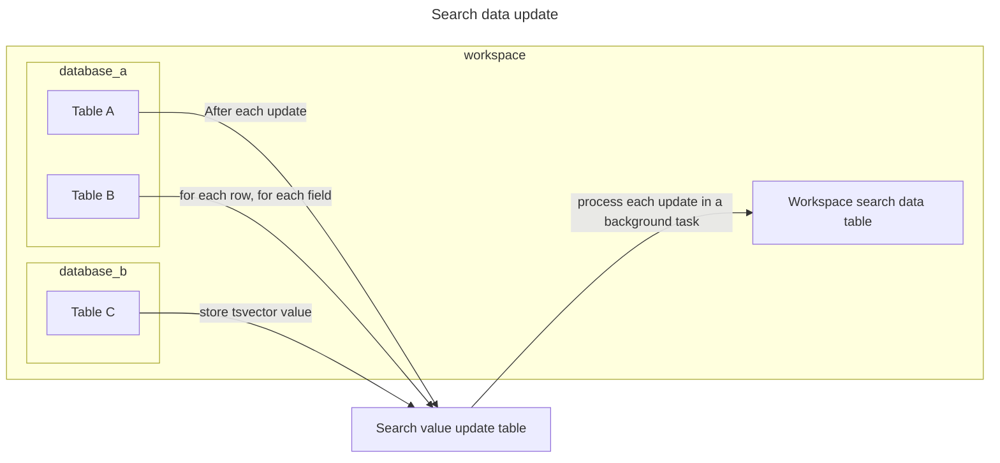
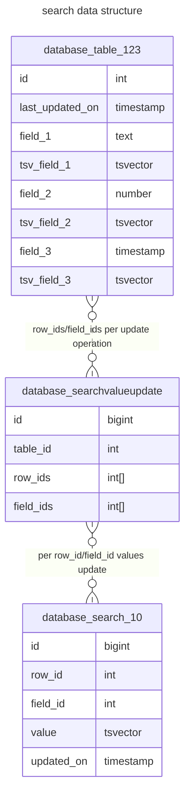

# Full-text search implementation v2

## Overview

Initial Baserow full-text search was implemented as a set of shadow tsv fields in each table, which were created and removed along with their originating fields, and updated each time a row has been updated. This system works well in general, but will cause database deadlocks under certain load/conditions. The old way will be referenced as `v1` in this document.

A new full-text search infrastructure splits user data tables (tables defined and modified by users) from search data tables (tables containing ts vectors for corresponding entries in user data tables). This way:
* search data table can be updated without blocking user data table
* search data can be aggregated and search can be workspace-wide.
This implementation will be referenced as `v2` in this document.

Both implementations can co-exist in a limited way. The implementation allow to mark specific tables as excluded from `v2`. The `v2` implementation assumes that the deployment contains workspaces and tables created, and populated before this feature has been deployed, and allow to migrate each table, as they're used. A "fresh" deployment will create workspaces and tables marked as ones using `v2` already.

## Main elements

`V2` search functionality works on per-workspace basis, and requires several objects to be present in the database:
* `database_workspacedatabasesettings` table stores per-workspace database-specific settings, in this case: search table schema version
* `database_search_$WORKSPACE` table stores per-workspace text search vectors for tables within the workspace. This table should contain only latest versions of tsvector values for each cell.
* `database_searchvalueupdate` global helper table that stores information about user data tables data modification, and allow to queue search data updates
* `database_table.search_data_state` field stores information on per-table `v2` search data migration. This field can take any of those values:
    + `NULL` - table is not using `v2` search but can be migrated to `v2`
    + `'ready'` - the table is using `v2` already
    + `'disabled'` - the table is excluded from using `v2`.

The functionality is implemented mostly using `baserow.contrib.database.search.handler:SearchHandler` class. This class exposes an interface that allows to:

 * Retrieve information about full-text search status globally (can it be used at all) or on a per-table basis (can a table be used with `v2` search, does it need a migration)
 * Create needed database objects for a workspace.
 * Migrate `v1` workspaces/tables to `v2`.
 * Schedule a search data update based on lists of modified row ids/field ids for a table
 * Run search data update based on a list of rows/fields modified for a table

Limited `v1` support is provided by `SearchHandlerCompat` class. 

Additionally, `baserow.contrib.database.search.search_builder:SearchBuilder` is used to construct term search queries using `v2` tables.

Various places in code, usually at handler level, call `SearchHandler` callback methods to inform about table schema/data modification.

## Migrating existing tables

`V2` search operates under assumption, that many workspaces or tables are still using `v1` search. Due to the fact that some deployments may contain hundreds of thousands of tables and thousands of workspaces, and any downtime should be limited, the `v1` to `v2` migration path is implemented so, that it will be executed on objects that are actually used, incrementally. There is no guarantee that this process will migrate all workspaces/tables in a deployment, as it reacts on actual usage. To ensure that all workspaces/tables are migrated, a separate, manual maintenance is needed. This aspect is not covered by this documentation.

Each table has a `database_table.search_data_status` field, which describes `v2` search status. 

A table can be migrated if all of following is true:
* full text search is enabled
* a table is not marked as `disabled` (excluded from `v2`)
* a table is not marked as `ready` (already migrated).

Workspace-wide database setting may be not present yet, but it will be created in a first run of a migration for any table within a workspace. Subsequent table migrations will not create settings entry nor search data table.

`v1` to `v2` migration is triggered from `view_loaded` signal (`view_loaded_maybe_create_tsvector` signal handler), which:
  * checks if table can be migrated and schedule `migrate_search_data_table` task for the table, if yes.
  * `migrate_search_data_table` task will receive table id and:
    + get workspace database settings row for the workspace associated
      - if no row can be retrieved, create new one and create search data table for the workspace
    + run table migration:
      - get a list of row ids which contain `NULL` values in any of tsv field.
      - for other rows, for each field, copy table's `id, $FIELD_ID value, last_updated_on, tsv_field_$FIELD_ID ` columns to search data table's `row_id, field_id, updated_on, value`. 
      - for row ids with `NULL` tsvector values:
        * schedule search data update (`SearchHandler.mark_table_data_change()` called with `skip_schedule=True` to not to enqueue a Celery task)
        * run scheduled search data update immediately (`SearchHandler.process_table_data_change()`)
      - mark `database_table.search_data_state='ready'` for the table.

## Updating search data

Search data update should be triggered when a certain type of events occur:

 * user data table schema is modified:
   + a field is added
   + a field type is changed
   + a field is removed permanently
 * user data table is modified:
   + a row is added
   + a row is updated
   + a row permanently removed
   + a row with a field that depends on another field (linkrow, lookup field, formula) has been created, updated or trashed. In the last case, originating cell won't trigger the update, but dependant fields should recalculate search data.

Actual event type list is longer, and contain events like:
 * a table is imported
 * a table is duplicated
 * a table is restored from a snapshot or from a template
 * a table is created or updated from data synchronisation

Following events should not trigger search data update:
 * a table is removed - trash system allows to restore a table, so we keep search data until a table is not purged
 * a field is removed - trash system allows to restore a field, so we keep search data until a field is not purged
 * a row is (or rows are) removed - trash system allows to restore deleted rows, so we keep search data until rows are not purged
 * a table structure/data is duplicated for a snapshot - a snapshot database is not linked to any usable workspace, so we cannot tell which search data table should be used.

Search data update is performed per-table. A table is considered as eligible for search data update, if:
 * full-text search is enabled
 * search table is created for the workspace
 * a table is marked as `READY`

Search data update is triggered usually by calling one of callback methods on `SearchHandler` (methods named with `after x event` pattern). Each callback can receive a different set of params, and should extract needed arguments to be passed to internal methods.

After calling, a callback should:
* get table id and, optionally, a list of row ids and field ids affected for the table
* call `SearchHandler.mark_table_data_change()`, which will:
  * check if the table can be updated
  * if the table is marked disabled, call appropriate `SearchHandlerCompat` method
  * if the table can be updated, create an entry in `database_searchvalueupdate` table for the modification.
  * add on commit callback to schedule `do_table_search_data_update` task.
    * scheduling will check for a per-table lock key in cache to avoid scheduling the task more than once
    * the task will be scheduled with a delay set in `SEARCH_DATA_UPDATE_GRACE_PERIOD` setting. 
* `do_table_search_data_update` task will be executed for a table after a grace period, and will:
  * get all pending search value updates for the table from `database_searchvalueupdate` table
  * for each update, it will:
    * get a list of fields affected (all table fields, if no fields are stated, all rows in a table, if no row ids is stated)
    * for each field, get a search expression based on a field type for rows affected
      * if there's no suitable search expression, the field is omitted from the update
    * remove previous entries in search data table for the combination of field ids/row ids.
    * add new entries for each combination of `row_id`/`field id`/`last_updated_on` with tsvector value calculated with a proper search expression.
  * remove processed updates.

The grace period can be increased if user data are modified frequently and in many operations in a short burs, if search accuracy is not the priority.

## Searching

While external API for search stays the same as in `v1`, `v2` search builds search query in a different way than `v1`. When a search is executed, it is usually done in the context of a single table. The query should join:

  * search data table rows where:
    * field id matches a field id from the table
    * value matches tsquery
  * table rows which match `row_id`s from search data query, excluding rows and fields that are trashed.
  * additionally, if the term searched is a number, the query should return a row with id matching that number.

`SearchBuilder` provides a simple interface to create a filtered queryset.

### Migrating to v1

In case that `v2` search doesn't work as intended, there is a path to bring back a deployment to `v1`. It requires manual maintenance and code changes:

* mark all tables as `disabled`
* change the `Table` model and set `search_data_state` field default to `disabled`
* call `update_table_tsvectors` command for all migrated tables
* restore `search.handler`, `search.tasks` and `search.signals` from before `v2` rollout.
* any additional cleanup (removal of workspace database settings table, search data tables, dropping `search_data_state` column) is not mandatory. 

### Limitations/caveats

There are several limitations/caveats in `v2`, that should be addressed/improved later: 
* disabled tables

  `disabled` state is not usually used. This state is needed mostly for tests. It may be used to selectively disable specific tables from `v2` search, but application is manual.

* no search expressions

  Search data update will skip fields that don't have any search expression.

* no tsvector value

  At the moment, search data table stores empty tsvector values that are calculated from search expression. It may be reasonable to skip such values, because the search data table will store latest data version only.

* related fields update (specific row ids in a dependent table)
  
  At the moment, search data update process will recalculate all values for a field, if search data update comes from a formula update/dependency.
  This can be limited to specific row ids, but requires a better support from update collector (which is on the way).

* storing dependent fields

  For linkrow/lookup fields, we try to store search data locally. This will cause a lot of data duplication (a row referenced in 10 other rows will be duplicated 10 times for those dependent rows). This can be improved and we can use field/row dependencies to store one value and reference it later.

* related fields query (instead of storing/querying for local table data, linkrow/lookups can be searched by joining search data for rows/fields from related tables)

  Related to latter point: when we search using related (linkrow/lookup/formula) fields, search will query local table data only, so we may be querying the same data (many references to one value) multiple times. We can improve this by resolving dependencies and pick specific row ids/field ids and query them instead.

* update many row ids

  Large search data updates (100k+ row ids) may lead to performance degradation in some cases. It would be good to optimize such updates, and, for example, split into smaller batches of row ids.
