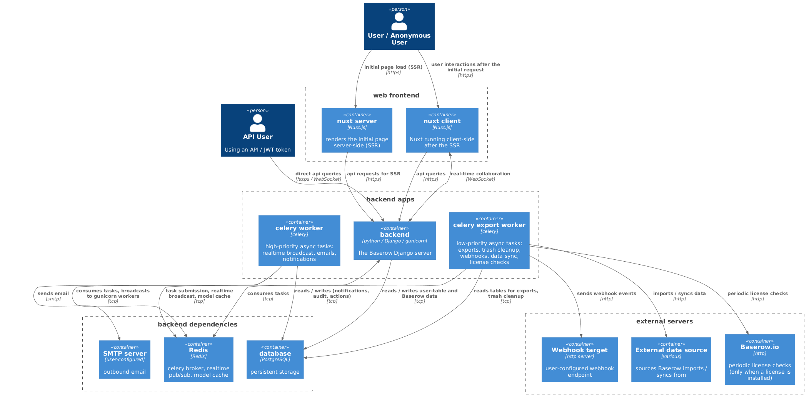

# Baserow Technical Introduction

> **New to the codebase?** Start with [Systems overview](systems-overview.md) for
> the map of major subsystems, then [Architectural patterns](../patterns/architecture.md)
> for the layered shape of a request, then [Registries](../patterns/registries.md) for
> the pattern most of the code uses. The deeper per-system guides (undo/redo,
> permissions, websockets, workspace search, …) are linked from the systems overview.

## Architecture

Baserow consists of two main components:

1. The **backend** is a Python Django application that exposes a REST API. This
   is the core of Baserow and it does not have a user interface. The persistent
   state is stored in a PostgreSQL database. See the
   [REST API spec](../apis/rest-api.md).
2. The **web frontend** is a [Nuxt](https://nuxtjs.org/) / [Vue](https://vuejs.org/)
   application that serves as the user interface for the backend. It communicates
   with the backend through the REST API and over websockets.



## Backend

The backend consists of the **core**, **api** and **database** apps. The package also
contains base settings that can be extended. The REST API is written as a decoupled
component which is not required to run Baserow. It is highly recommended though. The
same goes for the database app, which is written as a plugin for Baserow. Without it you
would only have the core which has functionality like authentication, workspaces and the
application abstraction.

### Handlers

If you look at the code of the API views you will notice that they use classes like
CoreHandler, TableHandler, FieldHandler etc. The API views are actually a REST API shell
around these handlers which are doing the actual job. The reason why we choose to do it
this way is that if we ever want to implement a Web Socket API, SOAP API or any other
API we can also build that around the same handler. That way we never have to write code
twice. It is also useful for when you want to do something via the command line. If you
for example want to create a new workspace you can do the following.

```python
from django.contrib.auth import get_user_model
from baserow.core.handler import CoreHandler

User = get_user_model()
user = User.objects.get(pk=1)
workspace = CoreHandler().create_workspace(user, name="Example workspace")
```

For the full shape of a request — view → service → action → handler → ORM,
plus signals and realtime — see [Architectural patterns](../patterns/architecture.md).

## Web frontend

The web-frontend consists of the **core** and **database** modules. The package also
contains some base config that can be extended. It is basically a user-friendly shell
around the backend that can run in your browser. It is made using
[NuxtJS](https://nuxtjs.org/).

### Style guide

There is a style guide containing examples of all components on
https://baserow.io/style-guide. Or if you want to see it on your local environment
http://localhost:8000/style-guide.

## Core concepts

### Workspaces

A workspace groups applications and the users who can see them — typically a
company or a team. Users invited to a workspace get access to every application
inside it, and realtime keeps everyone in sync without page reloads. Workspaces
are created, edited, and deleted through `baserow.core.handler.CoreHandler` or
the REST API.

### Application types

A Baserow **application** is a row in the `Application` table (polymorphic).
Each row is an instance of an **application type** registered in
`application_type_registry`. The "create new" button in the sidebar shows
every registered application type; plugins can register their own. See
[Registries](../patterns/registries.md) for the pattern, and
[Baserow vs Django](../patterns/baserow-vs-django.md) for the word overload
(a Baserow "application" is *not* a Django app).

Baserow ships several application types under `backend/src/baserow/contrib/`,
each with a matching module under `web-frontend/modules/`. These docs focus on
the **database** type — the spreadsheet-like one with tables, fields, views,
and formulas. Start at the [database plugin](database-plugin.md) page for its
architecture entry point.

Applications can be created, edited, and deleted through
`baserow.core.handler.CoreHandler` or the REST API. To add a new application
type from a plugin, see [Create application](../plugins/application-type.md).

## Cross-cutting patterns

A handful of patterns recur across nearly every subsystem. Read these once and
the rest of the code reads itself:

- Handlers, actions, signals, and the request flow → [Architectural patterns](../patterns/architecture.md).
- Registries — the extension point used everywhere → [Registries](../patterns/registries.md).
- The Django/Baserow word overloads (field, table, model, application, view) → [Baserow vs Django](../patterns/baserow-vs-django.md).

## Configuration

Environment variables and runtime settings are documented in
[Configuring Baserow](../installation/configuration.md). That page is the
canonical reference — don't duplicate values here.

## Where to next

1. [Systems overview](systems-overview.md) — map of the major subsystems.
2. [Architectural patterns](../patterns/architecture.md) — the shape of a request.
3. [Registries](../patterns/registries.md) — the extension pattern.
4. Pick the deep dive that matches what you're working on
   ([database plugin](database-plugin.md), [field system](../patterns/field-system.md),
   [permissions](permissions-guide.md), [websockets](websockets.md), …).
