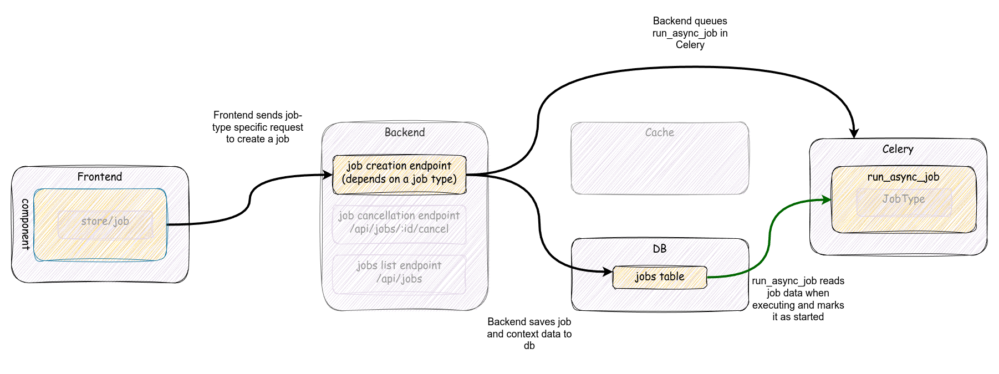
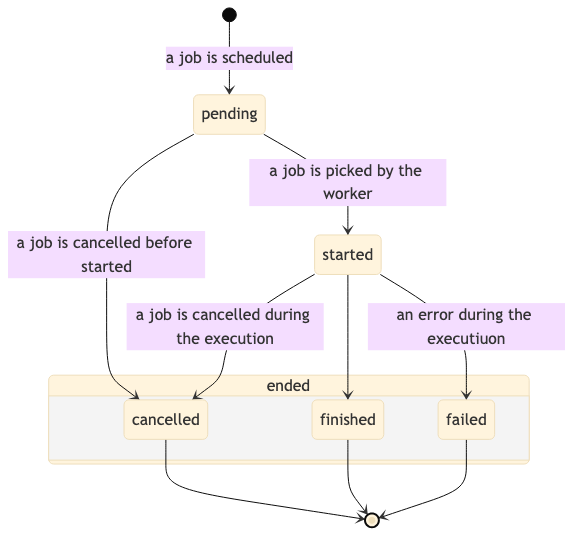
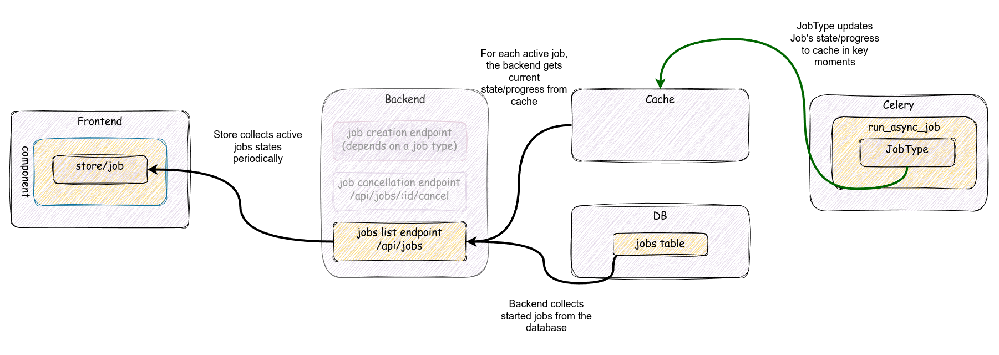
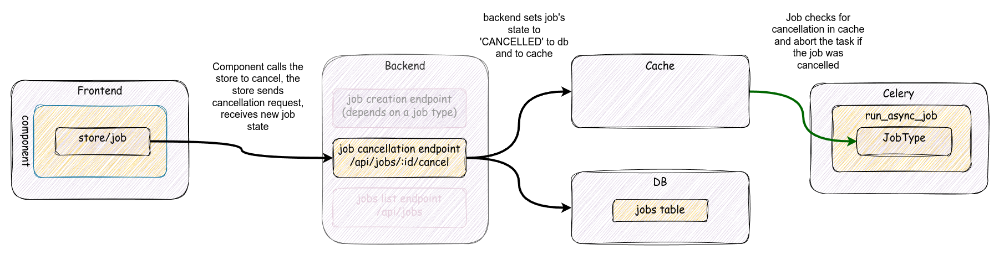

# Jobs

The Job framework is the high-level wrapper around [Celery](celery.md) for
user-triggered work that needs progress tracking, state, and cancellation.
Examples: imports, exports, snapshots, duplications, template installs,
data sync.

This page is the deep dive — what the moving parts are, how the runtime
behaves, what guarantees the framework offers. For the cookbook ("I want
to add a new job type"), see the
[JobType walkthrough](../patterns/jobtypes.md).

## When to use a Job

| You want | Use |
|---|---|
| Fire-and-forget async work (emails, notifications, webhook delivery) | A [plain Celery task](../patterns/celery-tasks.md) |
| User-triggered work the user is watching, with progress + cancel | A Job |
| Periodic background maintenance | A [periodic task](../patterns/celery-tasks.md#periodic-tasks), maybe singleton |
| Step-by-step work the user resumes if interrupted | Not Jobs — Jobs aren't resumable. Model the work yourself. |

Jobs always run on the `export` worker queue. They get a 30-minute soft
time limit by default (`BASEROW_JOB_SOFT_TIME_LIMIT`).

## Architecture

The moving parts:

- **`Job` model** — `baserow.core.jobs.models.Job`. Polymorphic base via
  `PolymorphicContentTypeMixin`. Stores user, state, `progress_percentage`,
  `error`, `human_readable_error`. Each job *type* subclasses this to add
  type-specific columns (which application, which table, …).
- **`JobType`** — `baserow.core.jobs.registries.JobType`. The class that
  knows how to validate inputs, run the work, serialize the job for the
  REST API, and clean up. Registered in `job_type_registry`.
- **`JobHandler`** — `baserow.core.jobs.handler.JobHandler`. The
  orchestration layer: `create_and_start_job`, `cancel_job`,
  `clean_up_jobs`.
- **`run_async_job` task** — `baserow.core.jobs.tasks.run_async_job`. The
  one Celery task all jobs flow through. It sets state, runs the JobType,
  catches exceptions, writes the final state.
- **Cache layer** — Redis-backed mirror of `state` and `progress_percentage`
  used to communicate around in-flight transactions. See
  [Cache layer](#cache-layer).
- **Frontend job store** — `web-frontend/modules/core/store/job.js`. A
  Vuex store that polls active jobs and dispatches lifecycle events.
- **`mixin/job`** — `web-frontend/modules/core/mixins/job.js`. The
  component-side helper that exposes job state as reactive properties.

The job-creation flow (matching the diagram):

1. Frontend calls a type-specific endpoint (no generic create endpoint —
   each domain owns its URL).
2. Backend validates, then calls
   `JobHandler().create_and_start_job(user, JobType.type, **values)`.
3. That handler runs `prepare_values`, creates the row, runs
   `after_job_creation`, and enqueues `run_async_job.delay(job.id)`
   from `transaction.on_commit(...)`.
4. The export worker picks up `run_async_job`, sets state to `started`,
   and calls `JobType.run(job, progress)`.
5. `run` updates `progress` at key moments; each update mirrors state to
   the cache and checks for cancellation.
6. `run` returns → state `finished`. Or raises → state `failed`. Or sees a
   cancel signal → state `cancelled`. All terminal.

## The state machine

`Job.state` is a string. Well-known values:

| State | Meaning |
|---|---|
| `pending` | Created, waiting for a worker. |
| `started` | A worker picked it up and `run` was called. |
| `finished` | `run` returned successfully. |
| `failed` | `run` raised. `error` and `human_readable_error` are set. |
| `cancelled` | The user cancelled. |

Job types are allowed to set descriptive intermediate values (e.g. the
snapshot job sets `import-table-{id}` while restoring each table). The
frontend mixin falls back to `getCustomHumanReadableJobState(state)` for
anything outside the well-known set.

`finished`, `failed`, and `cancelled` are **terminal** — never written
after they're set. Transitions allowed:

Cancellable states are `pending` and any non-terminal running state.
Cancelling a terminal job raises `JobNotCancellable`.

## State propagation

Two independent flows keep the frontend in sync with the worker:

**Worker → cache (write-side).** When `run` calls `progress.set_progress(...)`,
the `Progress` callback updates the in-memory `Job` instance and writes
`state` and `progress_percentage` to Redis. It does not save the row on
each progress tick. The cache write happens inside whatever transaction
the job is running in but is *visible immediately* — that's the whole
point of the cache layer (see below).

**Frontend → backend (read-side).** The job store polls `/api/jobs/?job_ids=...`
for active jobs at an adaptive interval. The job serializer reads `state`
and `progress_percentage` from the cache first, falling back to the DB if
the cache has expired.

## Cache layer

A running job's state and progress live in **Redis**, not just the
database. The reason: a job runs inside a transaction, so any DB writes
the job makes are invisible to other sessions until commit. The cache is
the side channel that lets:

- The worker tell the API what the current progress is.
- The API tell the worker "you've been cancelled."

Implementation:

- One key per job, scoped by `Job.id`. Serialized dict with `state` and
  `progress_percentage`.
- Written on every `progress.set_progress(...)` and on every state change.
- Read by the job serializer (with a DB fallback).
- Cleared in `run_async_job`'s `finally` block when the job finishes.

Implication for callers: don't hand-roll DB queries on `Job.state` for
in-flight jobs. Either go through the cache-aware serializer, or accept
that what you see may be stale. Inside the job itself,
`job.refresh_from_db()` plus the cache lookup is the canonical way to
check whether you've been cancelled.

## Cancellation

1. The user clicks cancel. The frontend mixin dispatches `job/cancel`,
   which `POST`s to `/api/jobs/{id}/cancel/`.
2. `JobHandler.cancel_job` sets `state=cancelled` on the model **and in
   the cache**. The cache write is what lets a running worker notice.
3. The worker checks the cache on every `progress.set_progress(...)` and
   raises `JobCancelled` if it sees the cancel signal.
4. `JobCancelled` rolls back the job's transaction (so partial DB writes
   are discarded), commits `state=cancelled`, and fires
   `JobType.on_cancelled` outside the rolled-back transaction.

| Job state | Cancellable | Exception |
|---|---|---|
| `pending` | yes | — |
| `started` | yes | — |
| any running state | yes | — |
| `failed` | no | `JobNotCancellable` |
| `cancelled` | no | — (already cancelled, no-op) |
| `finished` | no | `JobNotCancellable` |

**Operational implication:** `run` must call `progress.set_progress(...)`
regularly. Without that, the cancel signal never reaches the worker
until the job tries to exit — which defeats the point. For long-running
sub-steps, spawn child progress via `progress.create_child(...)` so each
step reports relative progress and acts as a cancellation checkpoint.

## Progress tracking

`Job.progress_percentage` is the value the frontend displays. The
`baserow.core.utils.Progress` helper keeps it accurate across nested
sub-tasks:

- Top-level: `progress = Progress(100)`, then
  `progress.register_updated_event(update_job_state)`.
- A sub-step: `child = progress.create_child(represents_progress=20, total=N)`.
  The child reports 0–100% of its own work; the parent translates that
  into its allocated 20% slice.

Children can have children. The shape isn't tied to Jobs — `Progress`
works on its own — but `JobHandler.run` wires the callback that ties
progress changes to the cache and to cancellation checks.

## Cleanup

Two periodic responsibilities, both handled by `clean_up_jobs` (in
`backend/src/baserow/core/jobs/tasks.py`, registered via `on_after_finalize`):

- **Expire timed-out jobs.** Any job whose `last_updated_on` (the cache-aware
  liveness timestamp updated by `Progress.set_progress`) is older than
  `BASEROW_JOB_SOFT_TIME_LIMIT` is marked `failed` with a timeout error.
  This is the safety net for workers that crashed mid-job without writing
  `failed` themselves.
- **Delete old terminal jobs.** Any job in a terminal state older than
  `BASEROW_JOB_EXPIRATION_TIME_LIMIT` (default 30 days) is hard-deleted.
  `JobType.before_delete` runs first — that's where you clean up files,
  scratch tables, anything outside Django's cascade.

Frequency: `BASEROW_JOB_CLEANUP_INTERVAL_MINUTES` (default 5 minutes).

## JobType API surface

A reference for what a `JobType` subclass can override. The
[JobType walkthrough](../patterns/jobtypes.md) shows how these fit
together end-to-end.

**Required:**

- `type: str` — the registry key. Must match the frontend `getType()`.
- `model_class: type[Job]` — your subclass of `Job`.
- `run(self, job, progress) -> None` — the actual work.

**Declarative configuration:**

- `max_count: int = 1` — max concurrent pending/running of this type per
  user. The default `_can_schedule_or_raise` enforces it.
- `serializer_field_names`, `request_serializer_field_names`,
  `serializer_field_overrides` — control what the REST API exposes.
- `job_exceptions_map: dict` — exception → human-readable error message
  used when `run` raises (the worker translates exceptions into the job's
  `human_readable_error` via this map).
- `api_exceptions_map` (inherited from `MapAPIExceptionsInstanceMixin`) —
  exception → API error code, applied by the HTTP layer at enqueue time.

**Optional hooks:**

| Hook | When | Use it for |
|---|---|---|
| `prepare_values(values, user)` | Before the model row is created. | Validate, look up, normalize. Return the dict that becomes the model kwargs. |
| `after_job_creation(job, values)` | After the row is saved, still synchronous in the request. | Side effects that need the job to exist (e.g. saving a file under the job's directory). |
| `transaction_atomic_context(job)` | At task start, wraps `run`. Defaults to `transaction.atomic()`. | Override to use a different isolation level, or to skip the transaction. |
| `before_delete(job)` | When the job is permanently deleted. | Clean up files, scratch tables, anything outside Django's cascade. |
| `on_cancelled(job)` | After `state=cancelled` is committed, outside the main transaction. | Side effects that should survive cancellation. |
| `on_error(job, error)` | After `state=failed` is committed. | Notify, alert, mark dependent resources as broken. |
| `_get_running_jobs(job)` / `_can_schedule_or_raise(running_jobs, new_job)` | At enqueue time. | Add per-job conflict rules (e.g. "only one export per table"). Default rule caps by `max_count`. |

## Tunables

| Env var | Default | What it controls |
|---|---|---|
| `BASEROW_JOB_SOFT_TIME_LIMIT` | 1800 (30 min) | Soft limit on `run_async_job`. |
| `BASEROW_JOB_EXPIRATION_TIME_LIMIT` | 30 days | Age before terminal jobs are deleted. |
| `BASEROW_JOB_CLEANUP_INTERVAL_MINUTES` | 5 | How often `clean_up_jobs` runs. |
| `baserowFrontendJobsPollingTimeoutMs` (frontend) | varies | Upper bound on the poll interval the job store uses. |

## See also

- [JobType walkthrough](../patterns/jobtypes.md) — the recipe side of
  this page. End-to-end how to add a new job type across backend and
  frontend.
- [Celery (deep dive)](celery.md) — the runtime Jobs sit on top of.
- [Celery tasks (cookbook)](../patterns/celery-tasks.md) — for cases
  where you don't need the Job machinery.
- [Architectural patterns](../patterns/architecture.md) — where
  `JobHandler` fits in the layered request shape.
- [Registries](../patterns/registries.md) — how `job_type_registry` works.
- [Action system](action-system.md) — actions and Jobs are orthogonal
  primitives; a Job can run inside an Action
  (`CreateSnapshotJob` calls `CreateSnapshotActionType.do(...)`).
- [Systems overview](systems-overview.md) — where Jobs fit on the map.
