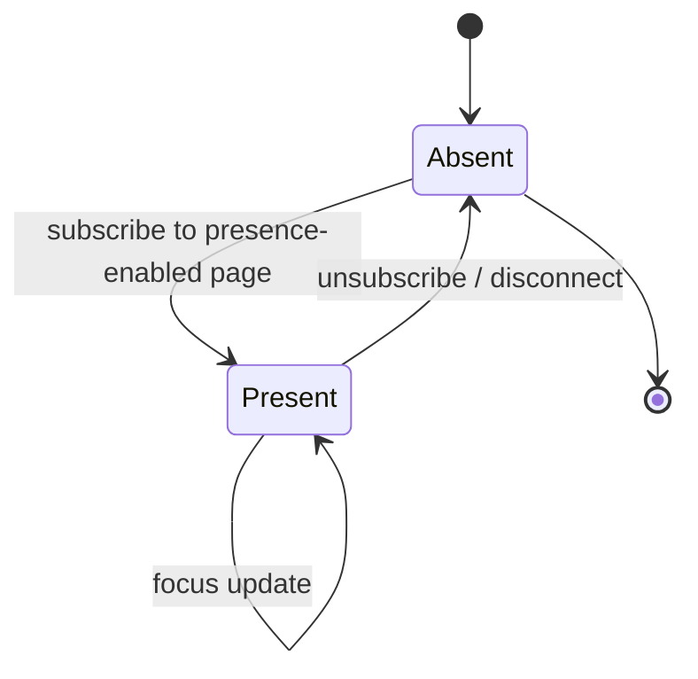
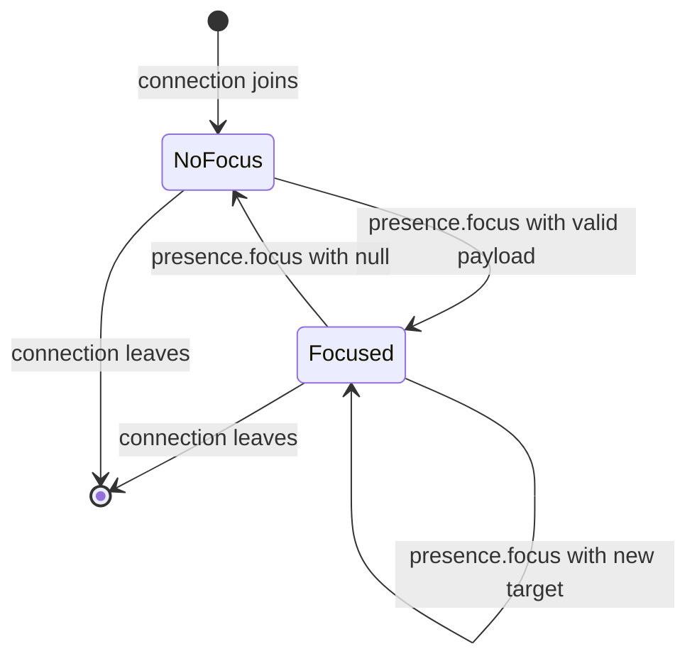

# Realtime Presence

This document describes the presence system built on top of Baserow's WebSocket infrastructure. For connection lifecycle, reconnection, event durability, and staleness detection, see [realtime-reliability.md](realtime-reliability.md). This document assumes familiarity with that foundation and uses its terminology (web socket ID, page subscriptions, channel groups, `previous_web_socket_id`) without re-defining them.

Presence solves one problem: **users working on the same page should see each other.** Who is here, and where are they focused.

The document is split into six sections:

1. **Terminology** — core concepts and their precise meanings.
2. **Architecture** — layered design, separation of concerns, Redis layout.
3. **Presence Lifecycle** — how a connection joins, leaves, and is cleaned up.
4. **Focus System** — typed focus payloads, validation, registry contract.
5. **Frontend Contract** — wire messages, client responsibilities, rendering rules.
6. **Security Boundaries** — what is visible on which page type.

---

## Section 1: Terminology

| Term | Definition |
|---|---|
| **Connection** | One WebSocket session, identified by a `web_socket_id` (UUID assigned on authentication). A single user may have multiple connections (e.g., multiple browser tabs). This is the unit that Redis tracks. |
| **User presence** | The user-visible concept: "User X is on this table." Derived by deduplicating connections by `user_id`. What the avatar bar shows. |
| **Presence channel** | A Redis hash at `presence:{group_name}` storing all connections present on a page. One hash per presence-enabled page instance (e.g., `presence:table-42`). Distinct from the channel-layer group used for broadcasting. |
| **Focus** | What a connection is looking at within a page. A typed object (e.g., `{type: "cell", row_id: 1, field_id: 2, editing: false}`) or `null`. Each connection has its own focus. |
| **Focus type** | A registry entry that defines the schema for one kind of focus (e.g., `cell`, `row`). Pluggable — new focus types can be added without modifying transport code. Not coupled to page types. |
| **Snapshot** | The list of all current connections in a presence channel, delivered when a connection subscribes. The bootstrap mechanism for populating the presence bar on page load. |
| **Presence-enabled** | A boolean flag on `PageType` (`presence_enabled = True`). Pages opt in explicitly; default is `False`. |
| **Self-echo suppression** | Server does not send `presence.join` / `.leave` / `.focus` back to the originating connection. Implemented via `ignore_web_socket_id` on the channel-layer broadcast. |
| **Self-focus suppression** | Client does not render its own focus through the presence system (cell borders, row highlights). The grid's native selection UI already shows the user's own position. The user's own avatar *does* appear in the presence bar. |
| **Focus staleness** | A focus state that is no longer trustworthy due to age. Enforced client-side, per focus type. Example: an `editing: true` indicator older than 30 seconds is likely stale. |

---

## Section 2: Architecture

### Layers

```
┌────────────────────────────────────────────────────────┐
│  L3  Frontend: Store + Rendering                       │
│  Vuex presence store, avatar bar, cell/row highlights  │
├────────────────────────────────────────────────────────┤
│  L2  Focus Types: Registry + Validation                │
│  PresenceFocusType subclasses, schema validation       │
├────────────────────────────────────────────────────────┤
│  L1  Transport: PresenceHandler + Redis                │
│  Join/leave/focus storage, broadcast, cleanup          │
└────────────────────────────────────────────────────────┘
```

**L1 (Transport)** owns Redis state and broadcast mechanics. It never names a concrete focus type — it delegates to L2 for validation and treats the validated focus as an opaque dict.

**L2 (Focus Types)** defines the schema for each kind of focus. Registered via `presence_focus_type_registry`. Each type validates its own payload shape. New types can be added by registering a `PresenceFocusType` subclass — no transport code changes required.

**L3 (Frontend)** consumes wire messages, maintains local state, and renders UI. It owns deduplication (connections → user presence for avatars), focus highlight rendering, and focus staleness enforcement.

### Redis Layout

Each presence channel is a Redis hash:

```
Key:    presence:{group_name}          (e.g., presence:table-42)
Fields: {web_socket_id} → JSON({user_id, focus, last_seen})
TTL:    PRESENCE_STALE_AFTER_SECONDS × 4 (coarse safety net)
```

No database models, migrations, or Celery tasks. Presence is intentionally ephemeral.

---

## Section 3: Presence Lifecycle

### Connection Presence States



### Join

When a connection subscribes to a presence-enabled page (`_add_page_scope`):

1. **Stale sweep** — prune entries in the presence channel older than the staleness threshold (defense-in-depth, see [Cleanup](#cleanup)).
2. **Upsert** — write this connection's entry to Redis: `{user_id, focus: null, last_seen: now}`.
3. **Snapshot** — read all other entries and return them in the `page_add` response as `presence_snapshot`.
4. **Broadcast** — send `presence.join` to the channel group (excluding this connection via self-echo suppression).

The snapshot gives the subscribing client the full current state. Subsequent changes arrive as individual `presence.join`, `presence.leave`, and `presence.focus` messages.

### Leave

Two paths, same outcome:

**Explicit unsubscribe** (navigate away, close modal):
- `_remove_page_scope` fires → `remove_presence` deletes the Redis entry → `broadcast_leave` notifies others.

**Disconnect** (close tab, network drop, proxy timeout):
- `disconnect()` fires → `_remove_all_page_scopes` iterates subscribed pages → same per-page cleanup as explicit unsubscribe.

Both paths are immediate once the event fires. For unclean disconnects (laptop lid, network loss), the proxy idle timeout eventually kills the TCP connection, which triggers the server-side disconnect event. The delay is bounded by the proxy timeout (typically 60 seconds).

### Reconnect

On reconnect, the client gets a new `web_socket_id`. The old connection's presence entry may still exist in Redis if the disconnect event hasn't propagated yet. To prevent ghost focus from the dead session:

1. The reconnecting client sends `previous_web_socket_id` (already part of the `realtime_subscribe` message).
2. On `add_presence`, the handler purges any entry keyed by `previous_web_socket_id` from the presence channel before inserting the new entry.

This mirrors the pattern used by the realtime event system for self-echo suppression during replay.

### Cleanup

Three mechanisms, in order of priority:

| Mechanism | Handles | Latency |
|---|---|---|
| `disconnect()` → `remove_presence()` | Clean close + proxy-timeout close | Immediate to proxy timeout |
| `previous_web_socket_id` purge | Reconnect before old disconnect propagates | On reconnect |
| Stale sweep on subscribe | True ghosts (disconnect event lost) | Opportunistic, on next join |
| Redis key TTL | Abandoned channels with zero activity | `STALE × 4` |

There is no client heartbeat. The disconnect event is the primary mechanism. The remaining mechanisms are defense-in-depth, each covering a specific failure mode the others miss:

| Scenario | Disconnect event | `previous_web_socket_id` purge | Stale sweep | Key TTL |
|---|---|---|---|---|
| Clean disconnect (close tab, navigate away) | ✓ | — | — | — |
| Unclean disconnect (laptop lid, network loss) | ✓ (via proxy timeout) | — | — | — |
| Reconnect before old disconnect propagates | — | ✓ | — | — |
| Lost disconnect, user never returns, channel stays active | — | — | ✓ (on next join) | ✗ (TTL refreshed by others) |
| Lost disconnect, user never returns, channel goes quiet | — | — | ✗ (no new joins) | ✓ |

The stale sweep uses a `last_seen` timestamp per entry (server-internal, never exposed on wire). The staleness threshold must be set well above the proxy idle timeout so that connected-but-idle users are never pruned. A user who has a table open but hasn't interacted is genuinely present — not stale.

---

## Section 4: Focus System

### Typing Convention

All presence data structures use `TypedDict` for type annotations, consistent with the existing wire message types in `ws/types.py` (e.g., `BroadcastToChannelGroupMessage`, `BroadcastToUsersMessage`). This includes focus payloads, wire messages, and snapshot entries. `TypedDict` is a dict at runtime (no conversion overhead for Redis/wire serialization) while providing static type checking and IDE support. Typed structures make the codebase more readable for both humans and LLMs generating or reviewing code.

### Focus Types

Each focus type is a `PresenceFocusType` subclass registered in `presence_focus_type_registry`. The transport resolves the type from `focus["type"]` and delegates validation.

Each focus type defines a corresponding `TypedDict` for its payload:

```python
class CellFocus(TypedDict):
    type: str
    row_id: int
    field_id: int
    editing: bool

class RowFocus(TypedDict):
    type: str
    row_id: int
```

| Focus type | `type` string | TypedDict | User action |
|---|---|---|---|
| Cell | `"cell"` | `CellFocus` | Select a cell in the grid |
| Row | `"row"` | `RowFocus` | Focus on a row (expand modal, checkbox select, etc.) |

Focus types are registered globally in `presence_focus_type_registry` — they are not grouped by or coupled to page types. A page type opts into presence (`presence_enabled = True`); a focus type defines a valid shape of focus. They don't reference each other. The transport connects them at runtime via `focus["type"]` dispatch. A focus type registered once is usable on any presence-enabled page.

A single page type can support multiple focus types. The table page accepts both `cell` and `row` focuses. New focus types (e.g., for dashboard or builder modules) are added by registering a `PresenceFocusType` subclass — no transport or page type changes required.

### Validation

Focus must be a dict because the transport uses `focus["type"]` to dispatch to the correct registry entry. This is the same pattern used throughout Baserow's WebSocket protocol — all messages are dicts with a `type` key for dispatch.

The base `PresenceFocusType.validate()` enforces:
- `focus` must be a dict.
- `focus["type"]` must match the registered type string.
- The serialized payload must be JSON-serializable and within `max_focus_bytes` (default 2048).

Subclasses add per-key schema checks matching their `TypedDict` definition (required fields, types). `validate()` returns the validated dict (typed as the corresponding `TypedDict`). Invalid payloads are silently dropped — no broadcast, no error frame to the sender.

### Focus Lifecycle



Focus is a property of a connection within a presence channel. It changes whenever the user interacts with the grid. Only the latest focus matters — there is no focus history.

### Focus Staleness

Focus staleness is enforced **client-side**. The server does not track or enforce focus TTLs.

Each focus type declares a staleness policy. The client timestamps each received focus event with `Date.now()` on arrival and stops rendering the focus indicator when it exceeds the type's threshold.

This is relevant for states that imply active engagement — `editing: true` becomes misleading after 30–60 seconds of silence. States like `editing: false` (passive selection) have longer or no staleness thresholds.

Server timestamps are not used because clock skew between server and client would make them unreliable for rendering decisions.

### Recipient Filtering (Future)

`PresenceFocusType` declares a `filter_for_recipient(focus, recipient_context)` hook. This is present in the registry contract but not wired in the transport. The default is identity (pass through). A future PR will wire this to enable filtered focus on restricted views (showing focus only for rows/fields the recipient can see, rather than stripping to `null`).

---

## Section 5: Frontend Contract

### Wire Messages

All wire messages are typed with `TypedDict` in `ws/types.py`, following the existing convention:

```python
class PresenceSnapshotEntry(TypedDict):
    user_id: int
    web_socket_id: str
    focus: dict | None

class PresenceJoinMessage(TypedDict):
    type: str
    channel: str
    user_id: int
    web_socket_id: str

class PresenceLeaveMessage(TypedDict):
    type: str
    channel: str
    user_id: int
    web_socket_id: str

class PresenceFocusMessage(TypedDict):
    type: str
    channel: str
    user_id: int
    web_socket_id: str
    focus: dict | None
```

**Server → Client:**

| Message type | When | TypedDict |
|---|---|---|
| `page_add` (extended) | Client subscribes to presence-enabled page | Existing fields + `presence_snapshot: list[PresenceSnapshotEntry]` |
| `presence.join` | Another connection subscribes | `PresenceJoinMessage` |
| `presence.leave` | Another connection unsubscribes / disconnects | `PresenceLeaveMessage` |
| `presence.focus` | Another connection changes focus | `PresenceFocusMessage` |

**Client → Server:**

| Message type | When | Payload |
|---|---|---|
| `presence.focus` | User changes selection or editing state | `{type: "presence.focus", page, parameters, focus}` |

### Client Responsibilities

**Self-echo suppression:** The server does not echo presence events back to the sender. The client applies its own state locally (e.g., adds itself to the presence store on subscribe, updates its own focus immediately on interaction).

**Self-focus suppression:** The client does not render its own focus through presence indicators. The grid's native selection UI (blue highlight, active cell border) already shows the user's own position. The user's own avatar appears in the presence bar.

**Deduplication:** The avatar bar shows unique users, not connections. Multiple connections from the same `user_id` (multiple tabs) collapse into one avatar. Focus highlights render per-connection — if a user has two tabs with different focuses, both cells are highlighted in the same color (same `user_id` = same color).

**Debounce:** Focus emission uses a single trailing debounce timer (configurable constant, e.g., `PRESENCE_FOCUS_DEBOUNCE_MS = 150`). Rapid cell navigation emits only the final position. The timer is shared across focus types — switching from cell selection to row focus within the debounce window emits only the row focus.

**Focus staleness:** The client timestamps each received focus event with `Date.now()`. Focus types declare staleness thresholds. The client stops rendering indicators that exceed the threshold (e.g., `editing: true` older than the configured TTL). This is enforced per focus type, not globally.

### Avatar Bar

- Appears in the grid view toolbar.
- Shows unique users present on the table (deduplicated by `user_id`).
- Maximum 3 avatars inline; additional users collapsed into "+N" counter.
  - 1 user → `PK`
  - 2 users → `PK` `BW`
  - 3 users → `PK` `BW` `DS`
  - 4 users → `PK` `BW` `+2`
- Each avatar: 2-character initials (first + last name), color derived from `user_id` via `hash(user_id) % N` (deterministic, same user = same color everywhere).
- Unknown users (not in workspace members): color circle with "?" initials.
- Own avatar included.

### Cell & Row Highlights

**Cell focus (other users):**
- Colored border in the user's assigned color.
- Small initials label near the cell.
- Only rendered for cells in the current viewport/buffer.

**Row focus (other users):**
- Full row highlight with colored background.
- Initials label on the row.
- Cell and row highlights render simultaneously on the same row.

**Editing indicator:**
- When `editing: true`, an animated `...` typing indicator appears next to the initials.
- One indicator per cell regardless of how many users are editing.
- Subject to focus staleness — disappears when the focus age exceeds the threshold.

**Multiple users on same target:**
- Labels collapse into "Selected by N users."
- Border/highlight uses the color of the first user to focus that target (first-to-arrive priority).
- Priority is per-target, based on when each connection's focus event for that target was received by the client (`Date.now()` on arrival).
- When a user leaves the target (changes focus or disconnects), their priority is lost. If they return, they get a new arrival timestamp.

---

## Section 6: Security Boundaries

| Page type | User presence (avatars) | Focus | Enforcement |
|---|---|---|---|
| Regular table views | Full | Full (cell, row) | Default behavior |
| Password-protected shared views | Full | Full | Authenticated = regular |
| Restricted views (enterprise) | Full | Always `null` — stripped server-side | Server strips focus before broadcast and storage. Client sends focus normally; server guarantees restricted view channels never contain or broadcast non-null focus. No row IDs, field IDs, or cell positions are leaked. |
| Public views | Disabled | Disabled | `presence_enabled = False`. No join/leave/focus messages, no snapshot. |

Focus stripping on restricted views is server-enforced. The client does not need to know whether it is on a restricted view — it sends focus normally, and the server is the authority on what gets broadcast.

---

## Configuration

| Setting | Default | Purpose |
|---|---|---|
| `BASEROW_PRESENCE_STALE_AFTER_SECONDS` | 300 | How long a presence entry can go without a `last_seen` refresh before the stale sweep considers it dead. Must be well above the proxy idle timeout. |

---

## Performance Constraints

- Presence must not degrade grid scrolling performance. Focus highlights only render for cells in the current viewport/buffer.
- Focus emission is debounced — keyboard navigation across cells must not cause visible lag or flood the server.

---

## Reference Table

| Concept | Backend | Frontend | Notes |
|---|---|---|---|
| Connection identifier | `web_socket_id` (scope) | `currentWebSocketId` | UUID assigned on auth. Used as Redis hash field and on wire. Single name everywhere. |
| Presence handler | `PresenceHandler` class (`presence.py`) | — | One instance per consumer. Owns all Redis I/O and broadcast issuance. |
| Presence channel | Redis hash at `presence:{group_name}` | — | Backend-only storage. Frontend consumes via snapshot + events. |
| Focus type registry | `presence_focus_type_registry` (`presence_focus_types.py`) | `app.$registry` focus type entries | Backend validates inbound. Frontend resolves rendering + staleness. |
| Focus validation | `PresenceFocusType.validate()` | — | Backend-only. Invalid payloads silently dropped. |
| Snapshot | `presence_snapshot` in `page_add` response | `presence/handleSnapshot` action | Bootstrap on subscribe. List of `{user_id, web_socket_id, focus}`. |
| Join broadcast | `presence.join` channel-layer event | `presence/handleJoin` action | Excludes sender via `ignore_web_socket_id`. |
| Leave broadcast | `presence.leave` channel-layer event | `presence/handleLeave` action | Excludes sender. |
| Focus broadcast | `presence.focus` channel-layer event | `presence/handleFocus` action | Excludes sender. |
| Focus emission | — | Debounced `sendPresenceFocus()` | Client → server. Single trailing timer across types. |
| User deduplication | — | `getUniqueUsersByChannel` getter | Collapses connections by `user_id` for avatar bar. |
| Color assignment | — | `getPresenceColor(userId)` | `hash(user_id) % N`. Deterministic, isolated function. |
| Multi-user ordering | — | `getFirstArrivedUser(users)` | Per-target, based on client-local arrival timestamp. Isolated function. |
| Opt-in flag | `PageType.presence_enabled` | — | Default `False`. Explicit `True` on table, restricted view. Explicit `False` on public view. |
| Recipient filter | `PresenceFocusType.filter_for_recipient()` | — | Declared but unwired. Future PR. |
| Self-echo suppression | `ignore_web_socket_id` in broadcast | — | Server-side. Sender never receives own events. |
| Self-focus suppression | — | Rendering logic | Client-side. Own focus not rendered as presence indicator. |
| Previous session cleanup | `previous_web_socket_id` in `realtime_subscribe` | `previousWebSocketId` | Purges dead session's presence entry on reconnect. |
