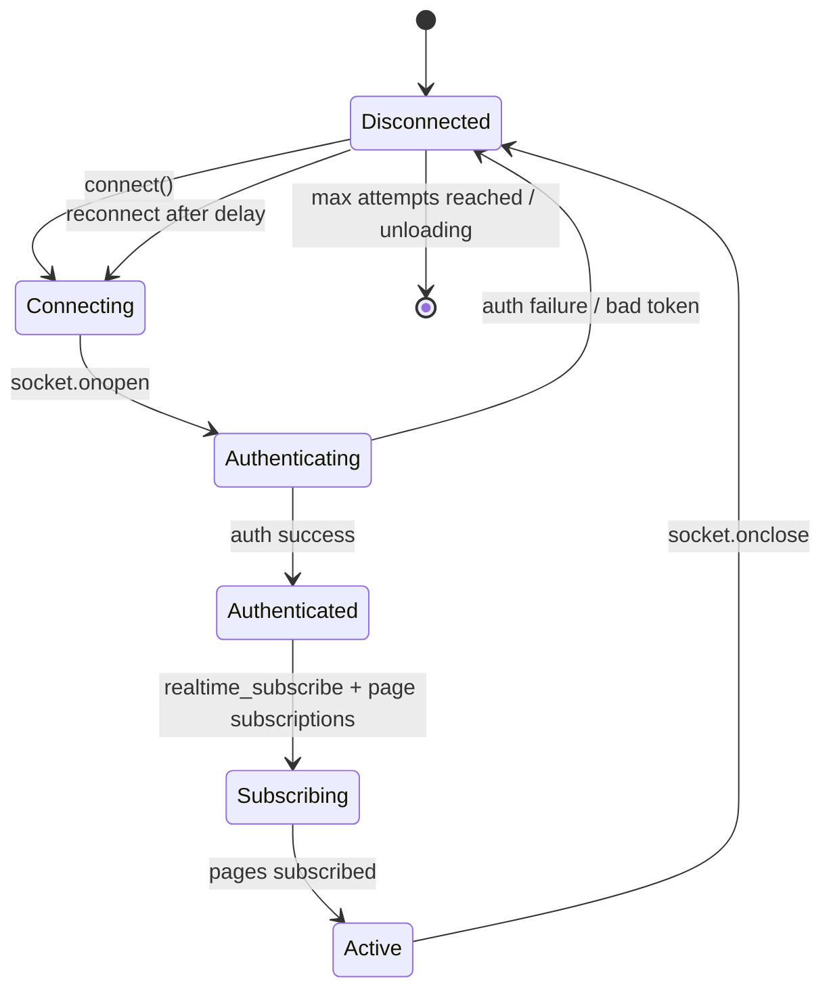
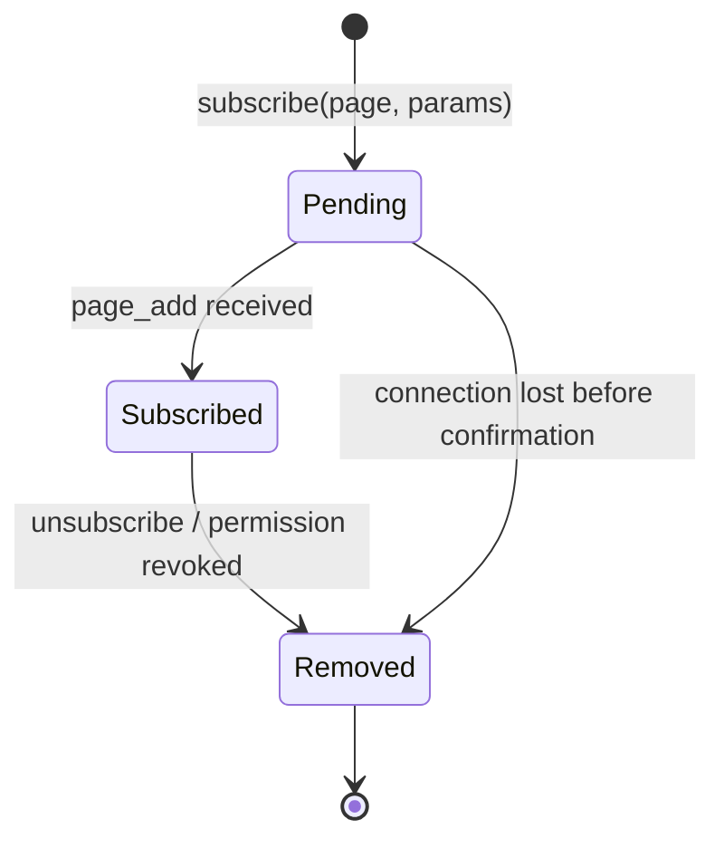
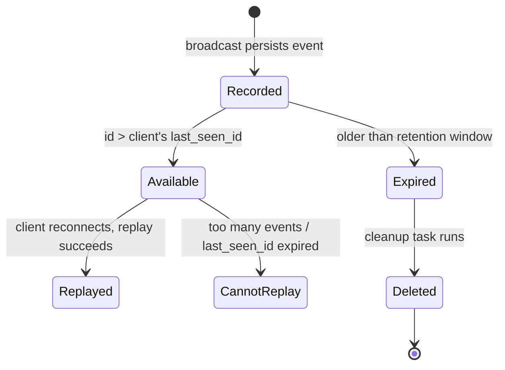
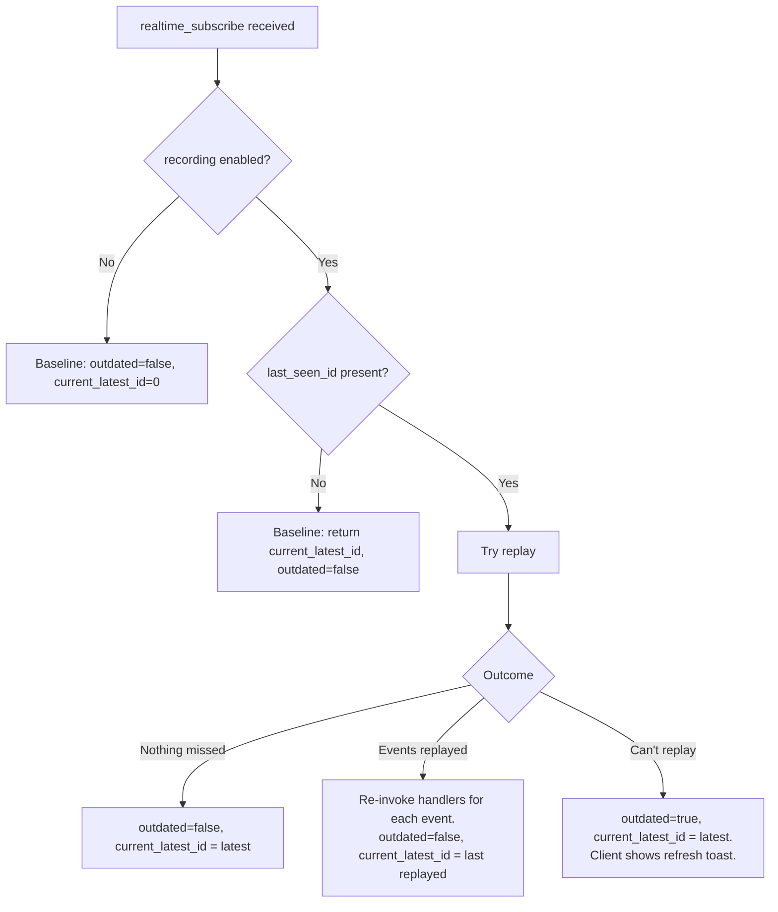

# Realtime Reliability

This document describes the reliability layer added on top of Baserow's existing WebSocket infrastructure. For the foundational concepts — consumers, channel groups, pages, subscriptions, and broadcasting — see [websockets.md](websockets.md).

The reliability layer solves one problem: **WebSocket connections drop, and when they do, the client may miss broadcasts.** Everything described here exists to detect that gap and either fill it (replay) or flag it (refresh).

The document is split into two sections:

1. **Connection Lifecycle** — how a connection is established, maintained, and recovered after a drop.
2. **Event Durability** — how broadcasts are persisted, replayed, and eventually cleaned up.

---

## Section 1: Connection Lifecycle

### Connection States

A WebSocket connection moves through the following states:



**Disconnected** — No socket. On first load this is the initial state.

**Connecting** — Socket created, TCP handshake in progress. JWT token and a client-generated `web_socket_id` are passed as query parameters.

**Authenticating** — Socket open. Server validates the token and responds with an `authentication` message containing `success`.

**Authenticated** — Token accepted. Client sends `realtime_subscribe` to establish the durability baseline (see [Section 2](#section-2-event-durability)) and re-subscribes to any pages it was tracking.

**Subscribing** — Page subscription messages in flight. Each page results in a `page_add` confirmation from the server.

**Active** — Fully operational. Client receives broadcasts and advances the last seen event ID.

### Per-Subscription States

Each page subscription has its own lifecycle within the connection:



Subscriptions can be removed server-side when permissions change — the backend sends a `users_removed_from_permission_group` event, and the consumer automatically unsubscribes affected pages.

### Web Socket ID

The **web socket id** is a UUID generated once at application boot and stored in the auth store. It persists across reconnects within the same page load. The client sends it as a query parameter on the WebSocket URL and as a `WebSocketId` HTTP header on REST API requests. The backend uses it to exclude the originating client from the broadcast of its own mutations.

The ID persists across reconnects within the same page load. A new tab or page refresh generates a fresh UUID.

### Reconnect Strategy

On socket close, the client schedules a reconnection attempt using **exponential backoff with jitter**:

```
delay = min(BASE_DELAY × 2^(attempt-1) + random(0, JITTER), MAX_DELAY)
```

| Constant | Value |
|---|---|
| `RECONNECT_BASE_DELAY` | 1000 ms |
| `RECONNECT_MAX_DELAY` | 30000 ms |
| `RECONNECT_MAX_ATTEMPTS` | 10 |
| `RECONNECT_JITTER` | 1000 ms |

After `RECONNECT_MAX_ATTEMPTS` consecutive failures, the client stops retrying and shows a "failed to connect" toast. The attempt counter resets on every successful open and on visibility change (returning to a background tab gets fresh attempts).

If the browser tab becomes hidden (`visibilitychange` event) while disconnected, the scheduled reconnect timer may fire. When the tab becomes visible again and the socket is still closed, the client resets the attempt counter and immediately attempts reconnection (bypassing the delay).

### Disconnect Detection

Disconnections are detected through WebSocket protocol-level close events and infrastructure-layer timeouts (reverse proxies, load balancers).

---

## Section 2: Event Durability

### Core Concept

Every broadcast that goes through the channel layer is **persisted** to the database before being sent. This creates a sequential log of all events, keyed by channel group. When a client reconnects, the server can look up what happened since the client last checked in and either replay those events or tell the client to refresh.

### Realtime Event

A **realtime event** is a single persisted broadcast, stored in the `ws_realtime_events` table:

| Field | Type | Purpose |
|---|---|---|
| `id` | `BigAutoField` | Sequential, monotonically increasing. Sent to clients as `_event_id`, tracked as the last seen event ID. |
| `channel_group` | `TextField` | Which channel group this event targeted (e.g., `table-42`, `users`). |
| `payload` | `JSONField` | The full broadcast message including type, user filters, and inner payload. |
| `created_at` | `DateTimeField` | When the event was recorded. Used for retention cleanup. |

Every broadcast is persisted before being sent over the channel layer. The returned `id` is injected into the payload as `_event_id`.

### UNLOGGED Table

The `ws_realtime_events` table is created as a PostgreSQL `UNLOGGED` table. This skips write-ahead log (WAL) entries, which significantly reduces write overhead for high-throughput event recording.

The trade-offs:

- **Crash recovery**: Table contents are lost on unclean shutdown. This is acceptable — events are ephemeral and clients handle the can't-replay path gracefully.
- **Replication**: UNLOGGED tables are invisible to streaming replication. Read replicas will not have the table's data. The database router detects unlogged models and routes all reads to the primary database.
- **Future UNLOGGED tables**: Any new unlogged model should follow the same convention so the database router can route reads to the primary automatically.

### Last Seen Event ID

The frontend tracks the highest `_event_id` it has observed and advances it on every incoming message. On reconnect, the client sends this value as `last_seen_id` — telling the server "I've seen everything up to this point."

The last seen event ID is global and monotonic — it persists continuously across the page load and is not reset on workspace or page changes. Event IDs come from a single database sequence, so a `last_seen_id` from one channel group is a valid baseline for any other.

### Kill Switch

When `BASEROW_REALTIME_REPLAY_MAX_EVENTS` is set to `0` (the default), event recording is completely disabled. No rows are written to the database, and the consumer returns a baseline response without querying for replay. This allows the feature to ship disabled and be validated on SaaS before enabling for all deployments.

### Event Lifecycle



### Reconnect: Three Outcomes

When a client reconnects and sends `realtime_subscribe` with a `last_seen_id`, the server determines one of three outcomes:



1. **Nothing missed** — `last_seen_id` is current. Empty event list returned. Client is up to date.
2. **Events replayed** — Missed events are fetched, filtered (excluding the client's own broadcasts via `web_socket_id`), and re-invoked through the consumer's handlers in order. The `"users"` channel group gets additional filtering — only events relevant to the specific user are included.
3. **Can't replay** — Either too many events were missed (exceeds `BASEROW_REALTIME_REPLAY_MAX_EVENTS`) or the client's `last_seen_id` has been cleaned up by retention. The server responds with `outdated=true` and the client shows a "workspace data is outdated" toast with a refresh action.

### Event Cleanup

A periodic Celery task removes events older than the configured retention window. The task runs every 60 minutes and deletes rows where `created_at` is older than `REFRESH_TOKEN_LIFETIME` (default 7 days). Retention is coupled to the refresh token lifetime because clients with expired tokens will re-authenticate and receive fresh state anyway.

### Configuration

| Setting | Default | Purpose |
|---|---|---|
| `BASEROW_REALTIME_REPLAY_MAX_EVENTS` | 0 (disabled) | Maximum number of missed events the server will replay. Beyond this, the client is told to refresh. Set to `0` to disable event recording and replay entirely. |

Event retention is coupled to `REFRESH_TOKEN_LIFETIME` (default 7 days). Events older than the refresh token lifetime are cleaned up hourly, since clients with expired tokens will re-authenticate and receive fresh state anyway.

See [configuration.md](../installation/configuration.md) for the full settings reference.
