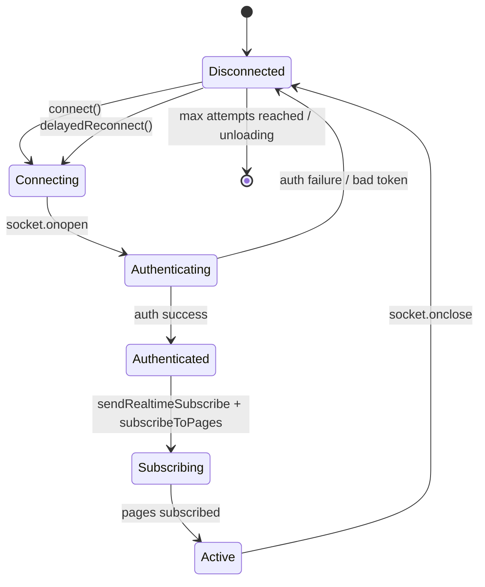
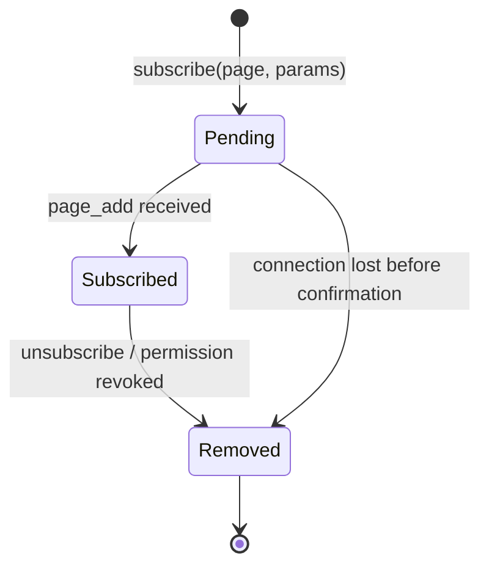
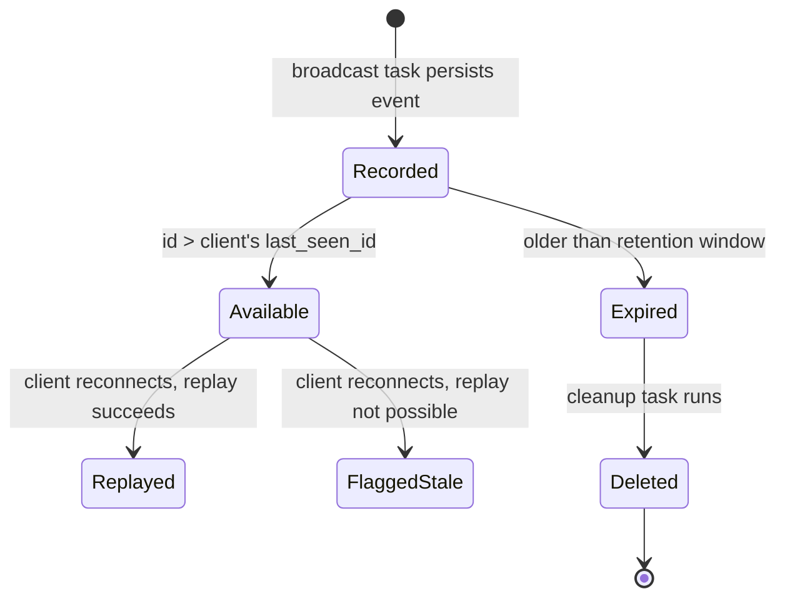
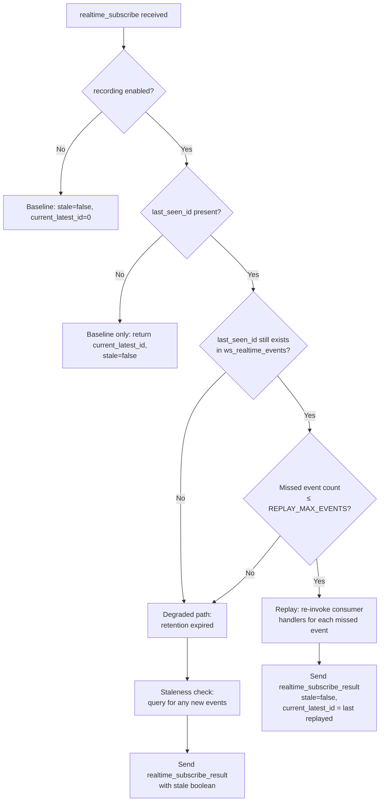

# Realtime Reliability

This document describes the reliability layer added on top of Baserow's existing WebSocket infrastructure. For the foundational concepts — consumers, channel groups, pages, subscriptions, and broadcasting — see [websockets.md](websockets.md).

The reliability layer solves one problem: **WebSocket connections drop, and when they do, the client may miss broadcasts.** Everything described here exists to detect that gap and either fill it (replay) or flag it (staleness toast).

The document is split into two sections:

1. **Connection Lifecycle** — how a connection is established, maintained, and recovered after a drop.
2. **Event Durability** — how broadcasts are persisted, replayed, and eventually cleaned up.

---

## Section 1: Connection Lifecycle

### Connection States

A WebSocket connection moves through the following states:



**Disconnected** — No socket. On first load this is the initial state.

**Connecting** — Socket created, TCP handshake in progress. JWT token and a client-generated `web_socket_id` are passed as query parameters.

**Authenticating** — Socket open. Server validates the token and responds with an `authentication` message containing `success`.

**Authenticated** — Token accepted. Client sends `realtime_subscribe` to establish the durability baseline (see [Section 2](#section-2-event-durability)) and re-subscribes to any pages it was tracking.

**Subscribing** — Page subscription messages in flight. Each page results in a `page_add` confirmation from the server.

**Active** — Fully operational. Client receives broadcasts and advances its high-water mark.

### Per-Subscription States

Each page subscription has its own lifecycle within the connection:



Subscriptions can be removed server-side when permissions change — the backend sends a `users_removed_from_permission_group` event, and the consumer automatically unsubscribes affected pages.

### Web Socket ID

The **web socket id** is a UUID generated by the client via `crypto.randomUUID()` once at construction time. It persists across reconnects within the same tab session and serves one purpose: **self-echo suppression**. The client sends it as a query parameter on the WebSocket URL and as a `WebSocketId` HTTP header on REST API requests. The backend uses it to exclude the originating client from the broadcast of its own mutations.

Because the ID persists across reconnects, the server can use it directly for filtering during replay and staleness checks — no separate "previous" ID tracking is needed. A new tab or page refresh creates a new `RealTimeHandler` instance with a fresh UUID, which is correct because there is no prior state to reconcile.

### Reconnect Strategy

On socket close, the client schedules a reconnection attempt using **exponential backoff with jitter**:

```
delay = min(BASE_DELAY × 2^(attempt-1) + random(0, JITTER), MAX_DELAY)
```

| Constant | Value |
|---|---|
| `RECONNECT_BASE_DELAY` | 1000 ms |
| `RECONNECT_MAX_DELAY` | 30000 ms |
| `RECONNECT_MAX_ATTEMPTS` | 10 |
| `RECONNECT_JITTER` | 1000 ms |

After `RECONNECT_MAX_ATTEMPTS` consecutive failures, the client stops retrying and shows a "failed to connect" toast. The attempt counter resets on every successful open and on visibility change (returning to a background tab gets fresh attempts).

If the browser tab becomes hidden (`visibilitychange` event) while disconnected, the scheduled reconnect timer may fire. When the tab becomes visible again and the socket is still closed, the client resets the attempt counter and immediately attempts reconnection (bypassing the delay).

### Disconnect Detection

The system relies on WebSocket protocol-level close events and infrastructure-layer timeouts (reverse proxies, load balancers) to detect disconnections. Client-side heartbeat or ping-pong is intentionally not implemented — the existing detection mechanisms provide sufficient coverage for the deployment topologies Baserow targets.

---

## Section 2: Event Durability

### Core Concept

Every broadcast that goes through the channel layer is **persisted** to the database before being sent. This creates a sequential log of all events, keyed by channel group. When a client reconnects, the server can look up what happened since the client last checked in and either replay those events or report that the client is out of date.

### Realtime Event

A **realtime event** is a single persisted broadcast, stored in the `ws_realtime_events` table:

| Field | Type | Purpose |
|---|---|---|
| `id` | `BigAutoField` | Sequential, monotonically increasing. Used as the high-water mark. |
| `channel_group` | `CharField` | Which channel group this event targeted (e.g., `table-42`, `users`). |
| `payload` | `JSONField` | The full broadcast message including type, user filters, and inner payload. |
| `created_at` | `DateTimeField` | When the event was recorded. Used for retention cleanup. |

Events are recorded by the persistence layer in the `ws` app. The returned `id` is injected into the payload as `realtime_update_id` before the broadcast is sent over the channel layer.

### UNLOGGED Table

The `ws_realtime_events` table is created as a PostgreSQL `UNLOGGED` table. This skips write-ahead log (WAL) entries, which significantly reduces write overhead for high-throughput event recording.

The trade-offs:

- **Crash recovery**: Table contents are lost on unclean shutdown. This is acceptable — events are ephemeral and clients handle the degraded path gracefully.
- **Replication**: UNLOGGED tables are invisible to streaming replication. Read replicas will not have the table's data. The `RealtimeEvent` model declares `UNLOGGED = True` as a class attribute, and the `ReadReplicaRouter` checks this attribute to route all reads to the primary database.
- **Future UNLOGGED tables**: Any new model that uses an UNLOGGED table should add `UNLOGGED = True` as a class attribute to opt out of replica routing automatically.

### High-Water Mark

The **high-water mark** is the highest `realtime_update_id` the client has observed. The frontend tracks this as `lastSeenRealtimeUpdateId` and advances it on every incoming message. On reconnect, the client sends this value as `last_seen_id` — telling the server "I've seen everything up to this point."

High-water mark resets on workspace switch because subscribed channel groups change entirely. The old mark is a valid sequence position, but replaying events for unsubscribed groups would be wasted work.

### Kill Switch

When `BASEROW_REALTIME_REPLAY_MAX_EVENTS` is set to `0` (the default), event recording is completely disabled. No rows are written to the database, and the consumer returns a baseline response without querying for replay or staleness. This allows the feature to ship disabled and be validated on SaaS before enabling for all deployments.

### Event Lifecycle



### Reconnect Decision Tree

When a client reconnects and sends `realtime_subscribe` with a `last_seen_id`, the server decides how to respond:



**Replay path** (happy path): The server fetches missed events, filters out those originated by the same client (using `web_socket_id` from the connection scope), and re-invokes the consumer's broadcast handlers in order. Each replayed event has its `realtime_update_id` injected so the frontend advances its high-water mark naturally. The `"users"` channel group gets additional filtering — only events relevant to the specific `user_id` are included, preventing unrelated user broadcasts from inflating the count.

**Degraded path**: When replay is not possible (retention expired or too many missed events), the server falls back to a staleness check. This tells the frontend whether *any* new events exist, but does not deliver the events themselves. If stale, a "workspace data is outdated" toast is shown with a "Refresh" action (full page reload).

### Staleness Detection

The **staleness check** returns a single boolean indicating whether any relevant events exist since `last_seen_id`. It uses the same OR-based query as the replay path — combining page-group and user-group conditions into a single query and checking for existence.

### Event Cleanup

A periodic Celery task removes events older than the configured retention window. The task runs every 60 minutes and deletes rows where `created_at` is older than `REFRESH_TOKEN_LIFETIME` (default 7 days). Retention is coupled to the refresh token lifetime because clients with expired tokens will re-authenticate and receive fresh state anyway.

This cleanup is what makes the degraded path possible: if a client disconnects for longer than the retention window, its `last_seen_id` will no longer exist in the table, and replay falls through to staleness detection.

### Configuration

| Setting | Default | Purpose |
|---|---|---|
| `BASEROW_REALTIME_REPLAY_MAX_EVENTS` | 0 (disabled) | Maximum number of missed events the server will replay. Beyond this, the degraded path (staleness check) is used instead. Set to `0` to disable event recording and replay entirely. |

Event retention is coupled to `REFRESH_TOKEN_LIFETIME` (default 7 days). Events older than the refresh token lifetime are cleaned up hourly, since clients with expired tokens will re-authenticate and receive fresh state anyway.

See [configuration.md](../installation/configuration.md) for the full settings reference.

---

## Reference Table

| Concept | Backend | Frontend | Notes |
|---|---|---|---|
| Connection ID | `web_socket_id` (scope, from query param) | `this.webSocketId` | Client-generated UUID via `crypto.randomUUID()`, persists across reconnects |
| High-water mark | `realtime_update_id` (injected into broadcast payloads) | `lastSeenRealtimeUpdateId` | Highest event ID observed by this client |
| Active workspace | `workspace_id` (in `realtime_subscribe` payload) | `lastSeenWorkspaceId` | Scopes the high-water mark; reset on workspace switch |
| Page subscription | `PageScope` dataclass (`page_type` + `page_parameters`) | `{page, parameters}` object in `this.pages[]` | Typed in backend, plain object in frontend |
| Subscription collection | `SubscribedPages` class (in `self.scope["pages"]`) | `this.pages` array | Backend tracks per-connection; frontend tracks intended subscriptions |
| Persisted broadcast | `RealtimeEvent` model (`ws_realtime_events` table) | — | Backend-only; frontend consumes via replay or staleness |
| Staleness flag | `stale` boolean | `data.stale` in `realtime_subscribe_result` | Single boolean; frontend shows toast if true |
| Reconnect subscribe | `realtime_subscribe` message type | `_sendRealtimeSubscribe()` method | Sent after auth on every connect |
| Subscribe result | `realtime_subscribe_result` message type | Handled in `registerCoreEvents()` | Contains `stale` boolean and `current_latest_id` |
| Channel group | `PageType.get_group_name()` return value | Not directly tracked | E.g., `table-42`; used as key in `ws_realtime_events` |
