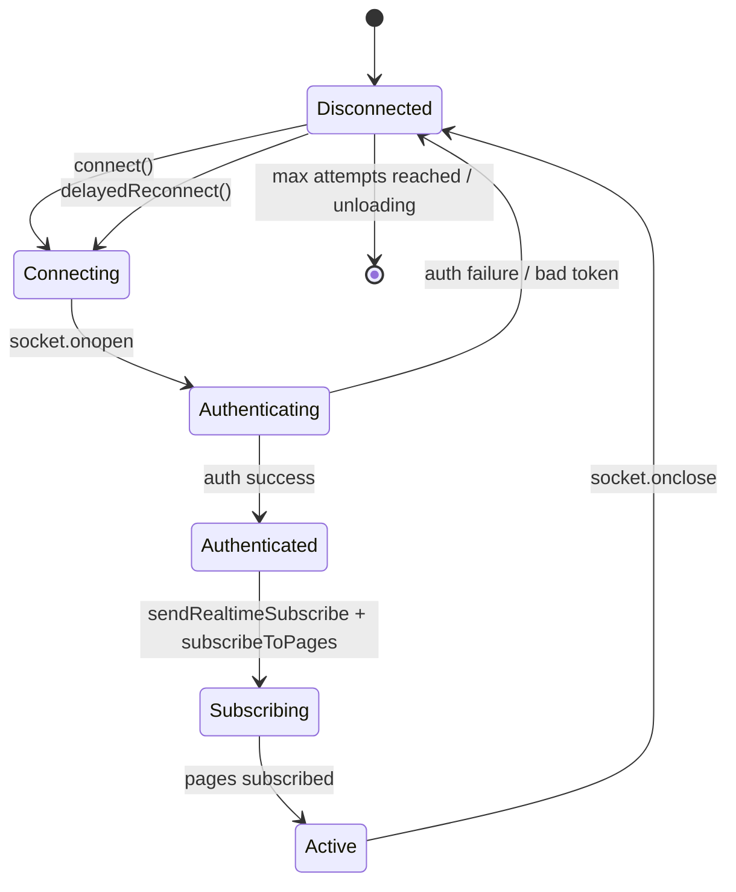
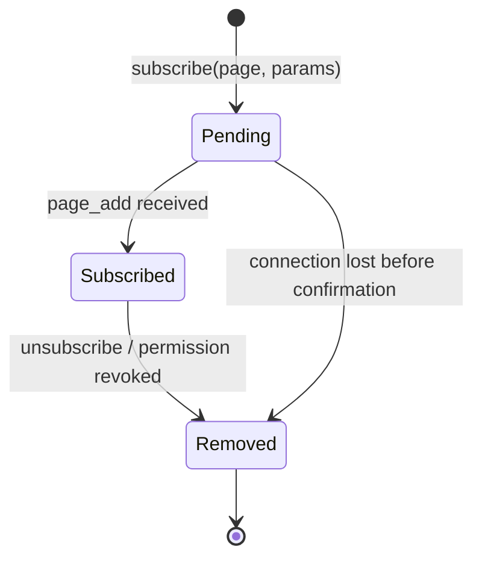
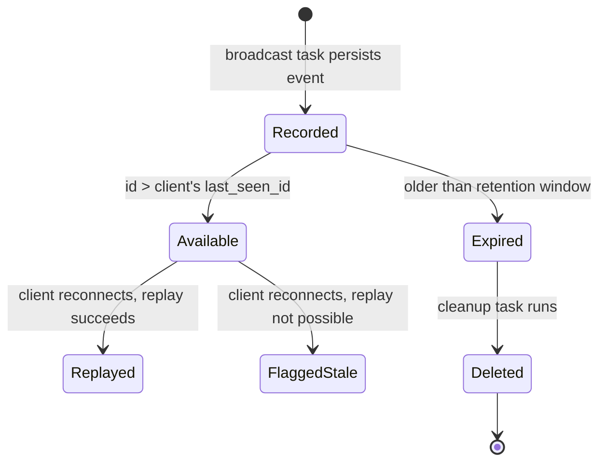
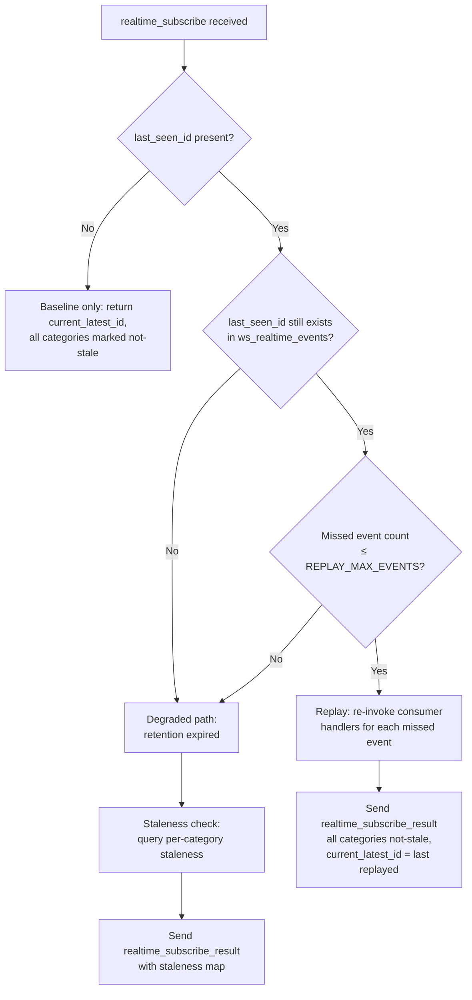

# Realtime Reliability

This document describes the reliability layer added on top of Baserow's existing WebSocket infrastructure. For the foundational concepts — consumers, channel groups, pages, subscriptions, and broadcasting — see [websockets.md](websockets.md).

The reliability layer solves one problem: **WebSocket connections drop, and when they do, the client may miss broadcasts.** Everything described here exists to detect that gap and either fill it (replay) or flag it (staleness toast).

The document is split into two sections:

1. **Connection Lifecycle** — how a connection is established, maintained, and recovered after a drop.
2. **Event Durability** — how broadcasts are persisted, replayed, and eventually cleaned up.

---

## Section 1: Connection Lifecycle

### Connection States

A WebSocket connection moves through the following states:



**Disconnected** — No socket. On first load this is the initial state. After a drop, the client stashes `currentWebSocketId` into `previousWebSocketId` for use during reconnection (see [Web Socket ID](#web-socket-id)).

**Connecting** — Socket created, TCP handshake in progress. JWT token is passed as a query parameter.

**Authenticating** — Socket open. Server validates the token and responds with an `authentication` message containing `success` and `web_socket_id`.

**Authenticated** — Token accepted. Client sends `realtime_subscribe` to establish the durability baseline (see [Section 2](#section-2-event-durability)) and re-subscribes to any pages it was tracking.

**Subscribing** — Page subscription messages in flight. Each page results in a `page_add` confirmation from the server.

**Active** — Fully operational. Client receives broadcasts and advances its high-water mark.

### Per-Subscription States

Each page subscription has its own lifecycle within the connection:



Subscriptions can be removed server-side when permissions change — the backend sends a `users_removed_from_permission_group` event, and the consumer automatically unsubscribes affected pages.

### Web Socket ID

The **web socket id** is a UUID assigned by the server on authentication. It serves one purpose: **self-echo suppression**. When a client makes a REST API change, it includes this ID as a `WebSocketId` HTTP header. The backend then excludes that socket from the broadcast of the resulting change, preventing the client from receiving its own mutation as if it were someone else's.

On reconnect, the client needs the same suppression applied to events it missed while offline. The frontend stashes the closing connection's ID as `previousWebSocketId` and sends it in the `realtime_subscribe` message. The server uses it to filter out events that originated from the same client during replay and staleness checks.

| State | `currentWebSocketId` | `previousWebSocketId` |
|---|---|---|
| First connect | Set on auth | `null` |
| Active | Set | `null` (cleared after subscribe result) |
| After disconnect | `null` | Stashed from `current` |
| After reconnect auth | New value | Still holds previous |
| After subscribe result | New value | Cleared to `null` |

### Reconnect Strategy

On socket close, the client schedules a reconnection attempt using **exponential backoff with jitter**:

```
delay = min(BASE_DELAY × 2^(attempt-1) + random(0, JITTER), MAX_DELAY)
```

| Constant | Value |
|---|---|
| `RECONNECT_BASE_DELAY` | 1000 ms |
| `RECONNECT_MAX_DELAY` | 30000 ms |
| `RECONNECT_MAX_ATTEMPTS` | 10 |
| `RECONNECT_JITTER` | 1000 ms |

After `RECONNECT_MAX_ATTEMPTS` consecutive failures, the client stops retrying and shows a "failed to connect" toast. The attempt counter resets on every successful open.

If the browser tab becomes hidden (`visibilitychange` event) while disconnected, the scheduled reconnect timer may fire. When the tab becomes visible again and the socket is still closed, the client immediately attempts reconnection (bypassing the delay).

### Disconnect Detection

The system relies on WebSocket protocol-level close events and infrastructure-layer timeouts (reverse proxies, load balancers) to detect disconnections. Client-side heartbeat or ping-pong is intentionally not implemented — the existing detection mechanisms provide sufficient coverage for the deployment topologies Baserow targets.

---

## Section 2: Event Durability

### Core Concept

Every broadcast that goes through the channel layer is **persisted** to the database before being sent. This creates a sequential log of all events, keyed by channel group. When a client reconnects, the server can look up what happened since the client last checked in and either replay those events or report that the client is out of date.

### Realtime Event

A **realtime event** is a single persisted broadcast, stored in the `ws_realtime_events` table:

| Field | Type | Purpose |
|---|---|---|
| `id` | `BigAutoField` | Sequential, monotonically increasing. Used as the high-water mark. |
| `channel_group` | `CharField` | Which channel group this event targeted (e.g., `table-42`, `users`). |
| `payload` | `JSONField` | The full broadcast message including type, user filters, and inner payload. |
| `created_at` | `DateTimeField` | When the event was recorded. Used for retention cleanup. |

Events are recorded by `record_realtime_event()` (single) or `record_realtime_events_bulk()` (batched) in `realtime_updates.py`. The returned `id` is injected into the payload as `realtime_update_id` before the broadcast is sent over the channel layer.

### High-Water Mark

The **high-water mark** is the highest `realtime_update_id` the client has observed. The frontend tracks this as `lastSeenRealtimeUpdateId` and advances it on every incoming message. On reconnect, the client sends this value as `last_seen_id` — telling the server "I've seen everything up to this point."

The high-water mark is scoped to a workspace. When the user switches workspaces, the mark resets to `null` because different workspaces may have different event ID spaces (events are global, but relevance is per-workspace).

### Event Lifecycle



### Reconnect Decision Tree

When a client reconnects and sends `realtime_subscribe` with a `last_seen_id`, the server decides how to respond:



**Replay path** (happy path): The server fetches missed events, filters out those originated by the same client (using `previous_web_socket_id`), and re-invokes the consumer's broadcast handlers in order. Each replayed event has its `realtime_update_id` injected so the frontend advances its high-water mark naturally. The `"users"` channel group gets additional filtering — only events relevant to the specific `user_id` are included, preventing unrelated user broadcasts from inflating the count.

**Degraded path**: When replay is not possible (retention expired or too many missed events), the server falls back to a staleness check. This tells the frontend *which categories* have new events, but does not deliver the events themselves.

### Staleness Detection

The **staleness map** is a dictionary keyed by category (derived from page type), with boolean values indicating whether new events exist in that category since `last_seen_id`:

```json
{
  "users": true,
  "table": false,
  "dashboard": false
}
```

Categories are derived from channel group names. Each subscribed page's channel group maps to its page type string as the category. The `"users"` group is always included for authenticated connections.

The staleness check runs two queries:
1. **Page-type groups** — checks all non-users channel groups in a single query, then maps stale groups back to their categories.
2. **Users group** — requires user-specific JSON filtering (checking `user_ids` arrays and `payload_map` keys) to avoid false positives from events targeting other users.

The frontend currently treats the staleness map as a boolean — `Object.values(updates).some(Boolean)`. If any category is stale, a "workspace data is outdated" toast is shown with a "Refresh" action (full page reload). The per-category granularity exists in the protocol for future use (e.g., refreshing only stale stores without a full reload).

### Event Cleanup

A periodic Celery task removes events older than the configured retention window. The task runs every 60 minutes and deletes rows where `created_at` is older than the retention threshold.

This cleanup is what makes the degraded path possible: if a client disconnects for longer than the retention window, its `last_seen_id` will no longer exist in the table, and replay falls through to staleness detection.

### Configuration

| Setting | Default | Purpose |
|---|---|---|
| `BASEROW_REALTIME_EVENTS_RETENTION_HOURS` | 24 | How long events are kept before cleanup deletes them. Determines the maximum offline window for successful replay. |
| `BASEROW_REALTIME_REPLAY_MAX_EVENTS` | 100 | Maximum number of missed events the server will replay. Beyond this, the degraded path (staleness check) is used instead. |

Both are environment variables. See [configuration.md](../installation/configuration.md) for the full settings reference.

---

## Reference Table

| Concept | Backend | Frontend | Notes |
|---|---|---|---|
| Connection ID | `web_socket_id` (scope) | `currentWebSocketId` | UUID assigned on auth, sent as `WebSocketId` HTTP header |
| Previous connection ID | `previous_web_socket_id` (in `realtime_subscribe` payload) | `previousWebSocketId` | Stashed on close, sent on reconnect, cleared after subscribe result |
| High-water mark | `realtime_update_id` (injected into broadcast payloads) | `lastSeenRealtimeUpdateId` | Highest event ID observed by this client |
| Active workspace | `workspace_id` (in `realtime_subscribe` payload) | `lastSeenWorkspaceId` | Scopes the high-water mark; reset on workspace switch |
| Page subscription | `PageScope` dataclass (`page_type` + `page_parameters`) | `{page, parameters}` object in `this.pages[]` | Typed in backend, plain object in frontend |
| Subscription collection | `SubscribedPages` class (in `self.scope["pages"]`) | `this.pages` array | Backend tracks per-connection; frontend tracks intended subscriptions |
| Persisted broadcast | `RealtimeEvent` model (`ws_realtime_events` table) | — | Backend-only; frontend consumes via replay or staleness |
| Staleness flag | `staleness_map` dict (`{category: bool}`) | `data.updates` in `realtime_subscribe_result` | Per-category on wire; frontend checks `any()` |
| Reconnect subscribe | `realtime_subscribe` message type | `_sendRealtimeSubscribe()` method | Sent after auth on every connect |
| Subscribe result | `realtime_subscribe_result` message type | Handled in `registerCoreEvents()` | Contains `updates` map and `current_latest_id` |
| Channel group | `PageType.get_group_name()` return value | Not directly tracked | E.g., `table-42`; used as key in `ws_realtime_events` |
| Category | Page type string (e.g., `"table"`, `"dashboard"`, `"users"`) | Keys in `data.updates` | Maps channel groups to staleness categories |
